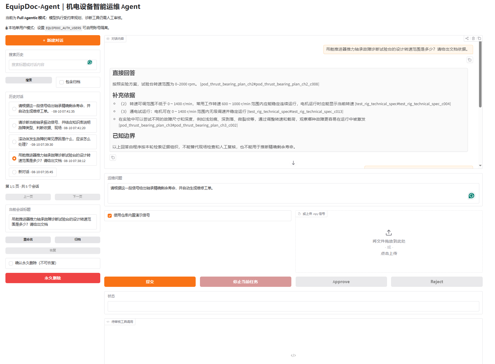
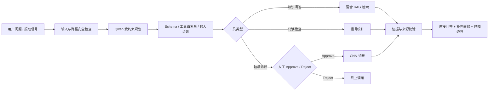
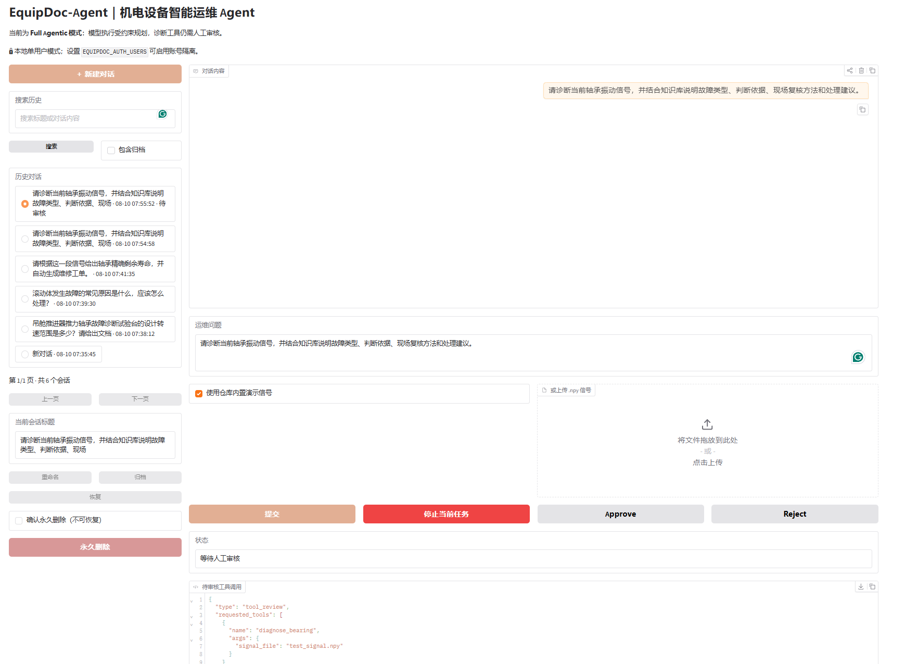
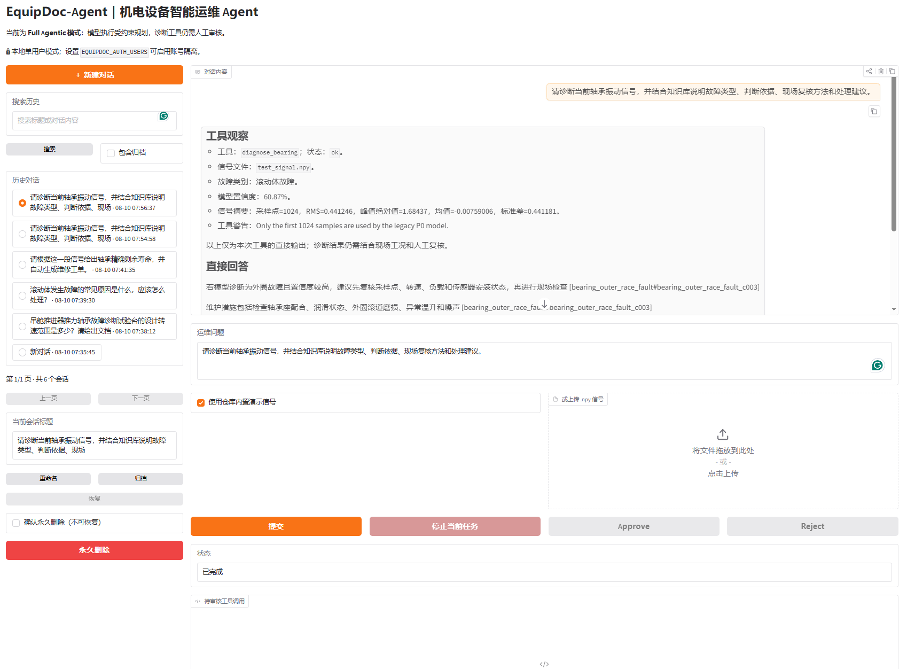

# EquipDoc-Agent

[](https://github.com/yu123-tqy/equipdoc-agent/actions/workflows/ci.yml)
[](pyproject.toml)
[](docs/rag_knowledge_source_catalog.md)
[](LICENSE)

面向机电设备运维场景的可审核 Agent。项目将本地 Qwen 规划、LangGraph 工作流、轴承振动信号工具、混合 RAG、人工审批和可追溯引用组合为一套可运行、可降级、可审计的演示系统。

> 项目用于技术研究和作品展示，不控制真实设备，不替代现场工程师，也不根据单段信号承诺精确剩余寿命或自动生成真实维修工单。



## 项目概览

| 项目维度 | 当前实现 |
|---|---|
| 目标场景 | 轴承知识问答、振动信号检查、故障辅助诊断和运维建议 |
| Agent 编排 | LangGraph 状态图、受约束 JSON 规划、最大步骤限制、确定性降级 |
| 人机协同 | 轴承诊断工具执行前必须 Approve/Reject |
| 工具能力 | 知识检索、只读信号检查、CNN 诊断接口 |
| RAG | BM25/词法 + BGE Dense Retrieval + RRF 融合与来源优先级重排 |
| 知识规模 | 58 篇文档、426 个结构化切片、133 个原文图片/公式资产 |
| 可追溯性 | 回答引用 `doc_id#chunk_id`，页面可展开本轮真实召回 Top 5 |
| 交互能力 | 支持停止当前任务、重新提问、审核诊断调用和查看检索快照 |
| 当前验证 | 149 项单元测试通过；AutoDL RTX 4090 完成真实 Qwen、CNN 与 Chroma 联调 |

## 为什么这样设计

机电运维问答同时涉及自然语言、设备参数、振动信号和高影响维修建议。让大模型直接自由生成或自由调用工具，会带来四类问题：

- 可能选错工具，或构造不合法参数；
- 可能绕过人工审核执行诊断；
- 可能引用不存在的资料，或把近似参数写成确定事实；
- 模型、向量库或权重缺失时可能静默失败。

本项目采用“模型理解与规划，程序校验与执行”的分层方式：



模型计划中的格式性问题可以被规范化和安全修复；只有连续两次都无法形成合法计划时，系统才进入确定性安全路由。格式容错不会放宽工具权限、路径边界或人工审批要求。

## 核心能力

### 1. 受约束 Agent 工作流

- 本地 Qwen 输出结构化意图和工具计划；
- 本地程序校验 JSON Schema、工具白名单、依赖关系和最大步数；
- 知识检索与信号检查保持只读；
- CNN 诊断必须经过人工 Approve/Reject；
- 计划不可用时显式进入确定性 fallback，而不是静默失败；
- LangGraph `thread_id` 保存有限的任务上下文和审核状态。

### 2. 可审计的轴承 RAG

知识库覆盖轴承类型、选型、安装配合、润滑、载荷寿命、典型故障、振动特征、现场复核、维修决策和安全边界，同时加入两份项目资料：

- 吊舱推进器推力轴承故障诊断方案；
- 轴承故障诊断缩比试验台合同技术资料。

资料冲突时采用明确的来源优先级：

| 来源 | 角色 | 优先级 |
|---|---|---:|
| 故障诊断实验方案 | 主要事实来源 | 100 |
| 合同技术资料 | 补充与交叉验证 | 70 |
| 通用轴承知识 | 机理、方法和维护建议 | 40 |

通用切片采用标题感知策略：目标约 420 字符、上限约 500 字符、重叠约 80 字符。项目 Word 资料额外保存标题层级、章节、页码、原始块位置、图片关系和来源元数据。

检索流程为：

1. BM25/词法检索保留型号、转速、故障部位等精确词；
2. 本地 `bge-small-zh-v1.5` 生成 512 维向量，从 Chroma 获取语义候选；
3. 使用 RRF 融合两路排名；
4. 根据参数焦点、故障对象、来源优先级和文档多样性重排；
5. 保存本轮 Top 5 快照，供回答引用和页面展开查看。

### 3. 面向问题的证据回答

知识问答使用清晰的三段结构：

1. **直接回答**：先回答型号、转速、原因或处理方法；
2. **补充依据**：列出支持结论的知识片段；
3. **已知边界**：说明还需要哪些信号、工况或人工检查。

参数问题优先抽取数值与单位；“原因是什么，应该怎么处理”这类复合问题会同时召回故障机理和处理建议。每个技术结论都可以通过 `doc_id#chunk_id` 回查。

### 4. Top 5 召回展示

回答下方的“查看本次召回 Top 5”可展示：

- 文档标题、`doc_id` 和 `chunk_id`；
- 原始章节与完整切片文本；
- RRF、词法、向量和来源优先级等排序信息。

按钮展示的是生成该回答时保存的检索快照，不会在点击后重新检索，便于现场说明真实召回效果。

### 5. 信号安全与人工审核

- UI 只接受上传文件或仓库内置样例，不接受用户输入的服务器路径；
- 上传文件被复制到 `runtime/uploads`，使用随机文件名并按 TTL 清理；
- 工具只允许访问 `data/samples` 和 `runtime/uploads`；
- 仅接受受限大小、数值有限的一维 `.npy` 信号；
- 审核界面只展示脱敏文件名，不暴露服务器绝对路径；
- CNN 输出必须结合信号质量、工况和人工检查解释。





## 运行模式

| 模式 | 用途 | 必需资源 | 结果边界 |
|---|---|---|---|
| Demo | 本地快速体验、CI、工作流展示 | Python 和 Demo 依赖 | 固定诊断案例会明确标注，不代表真实模型推理 |
| Full Agentic | AutoDL 完整演示 | Qwen、CNN、归一化文件、BGE、Chroma | 真实规划、检索和工具调用，仍受人工审核与安全规则约束 |

## 快速运行 Demo

Demo 模式不需要 GPU、Qwen、CNN 权重或向量数据库。

### 1. 创建环境

Windows PowerShell：

```powershell
python -m venv .venv
.\.venv\Scripts\Activate.ps1
python -m pip install --upgrade pip
pip install -e ".[demo]"
Copy-Item .env.example .env
```

Linux：

```bash
python -m venv .venv
source .venv/bin/activate
python -m pip install --upgrade pip
pip install -e ".[demo]"
cp .env.example .env
```

### 2. 健康检查与测试

```bash
python -m equipdoc_agent.health --strict
python scripts/demo_smoke.py
python -m unittest discover -s tests -q
```

Demo 模式下，CNN 权重、归一化文件和 Chroma 可以显示为非必需项。

### 3. 启动页面

```bash
python app_gradio.py
```

默认访问：

```text
http://127.0.0.1:7860
```

### 4. 体验审核流程

1. 勾选“使用仓库内置演示信号”；
2. 输入“请诊断当前轴承信号，并给出判断依据和处理建议”；
3. 点击“提交”，查看待审核工具；
4. 点击 Approve 继续，或点击 Reject 验证拒绝分支；
5. 查看工具输出、知识依据、边界和本轮 Top 5。

## AutoDL Full Agentic 演示

完整环境建议使用三个终端：Qwen 服务、健康检查、Gradio 页面。

### 1. 安装完整依赖

```bash
python -m venv .venv
source .venv/bin/activate
pip install -e ".[demo,ml,rag]"
cp .env.example .env
```

### 2. 配置 `.env`

```dotenv
EQUIPDOC_DEMO_MODE=false
EQUIPDOC_AGENTIC_MODE=true
EQUIPDOC_AGENT_MAX_STEPS=3

EQUIPDOC_LLM_BASE_URL=http://127.0.0.1:8001/v1
EQUIPDOC_LLM_MODEL=qwen-equipdoc
EQUIPDOC_LLM_API_KEY=EMPTY
EQUIPDOC_LLM_TIMEOUT_SECONDS=120

EQUIPDOC_BEARING_MODEL_PATH=/path/to/bearing_cnn.pth
EQUIPDOC_BEARING_NORM_PATH=/path/to/norm.npy

EQUIPDOC_RAG_ENABLED=true
EQUIPDOC_RAG_DB_DIR=vector_db/chroma_equipdoc
EQUIPDOC_RAG_COLLECTION=equipdoc_rag
EQUIPDOC_EMBEDDING_MODEL=/path/to/bge-small-zh-v1.5
EQUIPDOC_RAG_TOP_K=5

EQUIPDOC_SERVER_HOST=0.0.0.0
EQUIPDOC_SERVER_PORT=7860
```

模型权重、`.env`、Chroma 目录、处理后私有数据和上传文件都不应提交 Git。

### 3. 构建 Chroma 索引

第一次运行、切片更新或 Embedding 模型变化时执行：

```bash
HF_HUB_OFFLINE=1 TRANSFORMERS_OFFLINE=1 \
python scripts/build_rag_index.py --reset
```

普通重启不需要重复构建。当前索引应包含 426 个切片，集合名为 `equipdoc_rag`。

### 4. 终端 A：启动 Qwen

```bash
HF_HUB_OFFLINE=1 TRANSFORMERS_OFFLINE=1 \
python scripts/serve_qwen_openai.py \
  --model-path /path/to/Qwen2.5-7B-Instruct-EquipDoc \
  --served-model-name qwen-equipdoc \
  --host 127.0.0.1 \
  --port 8001
```

### 5. 终端 B：检查服务

```bash
python scripts/check_full_service.py \
  --base-url http://127.0.0.1:8001/v1 \
  --model qwen-equipdoc \
  --output artifacts/p2/service_check_latest.json

python -m equipdoc_agent.health --strict
```

### 6. 终端 C：启动页面

```bash
python app_gradio.py
```

更完整的 AutoDL 路径配置、演示顺序和问题排查见 [RAG 知识库扩展与演示交接文档](docs/rag-knowledge-expansion-demo-handoff.md)。

## 推荐演示问题

知识问答时取消勾选内置演示信号：

```text
结合故障诊断方案和试验台合同，说明该项目如何完成推力轴承故障模拟、信号采集和诊断验证。
```

```text
吊舱推进器推力轴承故障诊断试验台的设计转速范围是多少？请给出文档依据。
```

```text
试验台使用的轴承型号是什么？请给出文档依据。
```

```text
滚动体发生故障的原因是什么，应该怎么处理？
```

诊断演示时勾选内置样例信号：

```text
请诊断当前轴承信号，并结合知识库说明故障类型、诊断依据、现场复核方法和处理建议。
```

## 项目结构

```text
equipdoc-agent/
├─ app_gradio.py                   # Gradio 入口
├─ src/equipdoc_agent/
│  ├─ agent/                       # LangGraph、规划、工具执行与证据回答
│  ├─ rag/                         # 混合检索、索引清单与降级
│  ├─ tools/                       # 信号检查与轴承诊断工具
│  ├─ models/                      # CNN 结构
│  ├─ config.py                    # 环境配置
│  ├─ health.py                    # 启动健康检查
│  └─ retrieval_display.py         # Top 5 检索快照展示
├─ data/
│  ├─ knowledge/                   # 58 篇结构化知识文档
│  ├─ knowledge_assets/            # 原文图片和公式资产
│  ├─ knowledge_chunks.jsonl       # 426 个 Chroma 兼容切片
│  ├─ knowledge_chunk_overrides.jsonl
│  ├─ knowledge_source_anchors.jsonl
│  ├─ eval/                        # 固定评测输入
│  └─ samples/                     # 公开演示信号
├─ scripts/                        # 索引、服务、评测与检查脚本
├─ tests/                          # 单元与回归测试
├─ docs/                           # 架构、RAG、演示和交接文档
├─ artifacts/                      # 精简后的最终评测证据
├─ .env.example
├─ pyproject.toml
├─ Dockerfile
└─ docker-compose.yml
```

## 测试与评测

### 当前代码验证

```bash
python -m unittest discover -s tests -q
python -m ruff check .
python scripts/build_knowledge_chunks.py --check
```

当前清理分支已完成 **149 项单元测试，全部通过**。测试覆盖规划解析与修复、工具权限、人工审核、引用校验、RAG 重排、来源优先级、Top 5 展示、任务停止、上传安全、运行时清理和索引清单等。

### RAG 检索结果

| 评测 | 结果 | 口径 |
|---|---:|---|
| 项目资料 20 题 | Hit@5 100%，MRR@10 83.25% | BM25；实验方案与合同资料的文档级命中 |
| 扩展知识 100 题 | Hit@5 91%，MRR@10 77.24% | BM25；58 文档、426 切片 |

这些指标衡量检索命中，不等于最终回答正确率。

### 真实 Qwen + CNN 归档评测

仓库保留了 RTX 4090 环境的最终归档证据：

- 56-case / 64-turn 固定自动合同通过 64/64；
- 平均 / p50 / p95 端到端延迟为 5.100 / 5.889 / 9.926 秒；
- 38 个知识回答走结构化证据路径；
- 规划路径包含模型首轮、重试和确定性 fallback；
- 人工质量复核未完成，CNN 也没有可信的跨来源 Group Split 准确率。

归档结果对应当时冻结的代码、输入和环境，不应解释为当前开放问题正确率、模型规划准确率或工业诊断准确率。最新 RAG、规划容错、任务停止和回答覆盖修复由当前单元测试与 AutoDL 现场联调验证，尚未重新声明新的全量人工质量指标。

最终证据保存在：

- [`artifacts/p1/`](artifacts/p1/)
- [`artifacts/p2/`](artifacts/p2/)
- [`artifacts/p2_1/agentic_eval.json`](artifacts/p2_1/agentic_eval.json)
- [`artifacts/p2_2/demo_eval_run_3.json`](artifacts/p2_2/demo_eval_run_3.json)
- [`artifacts/p2_2/formal_regression_64_turn_fix3.json`](artifacts/p2_2/formal_regression_64_turn_fix3.json)

## 安全与适用边界

- 项目不控制真实设备，不执行停机、调参或维修动作；
- CNN 结果只用于辅助演示，必须结合工况、信号质量和人工检查；
- 不根据单段信号推断精确剩余寿命；
- 不把自动合同通过率表述为人工回答正确率；
- 不把 RAG Hit@5 表述为最终问答准确率；
- 不把单次分类置信度表述为模型总体准确率；
- 项目资料经过结构化整理，但仍应结合原始方案和现场版本复核；
- 正式扩展时应补充标准、教材和厂商手册的版本、适用设备与失效日期。

## 文档索引

| 文档 | 内容 |
|---|---|
| [系统架构](docs/architecture.md) | 工作流、工具边界、RAG 与部署结构 |
| [可信评测报告](docs/evaluation-report.md) | P1 基线、指标口径与限制 |
| [安全与证据评测](docs/p1-2-safety-grounding-report.md) | 高风险边界和引用校验 |
| [RAG 项目资料说明](docs/rag_project_sources.md) | 两份项目资料、切片和优先级 |
| [知识来源目录](docs/rag_knowledge_source_catalog.md) | 58 篇知识文档目录 |
| [知识覆盖矩阵](docs/rag_knowledge_coverage_matrix.md) | 轴承知识主题覆盖情况 |
| [演示交接文档](docs/rag-knowledge-expansion-demo-handoff.md) | 本轮修改、AutoDL 启动和完整演示流程 |
| [面试演示 Runbook](docs/interview-demo-runbook.md) | 3～5 分钟演示顺序 |
| [项目讲解话术](docs/interview-project-talk-track.md) | 项目表达与追问应答 |

## Docker Demo

```bash
docker compose up --build
```

浏览器打开 `http://127.0.0.1:7860`。Docker Demo 不包含 Qwen、CNN 权重或 Chroma 数据库。

## License

本仓库使用作品展示许可，允许招聘、教育和个人作品评审。第三方模型、数据、文档和商标遵循各自许可，详见 [`LICENSE`](LICENSE) 与 [`NOTICE.md`](NOTICE.md)。
