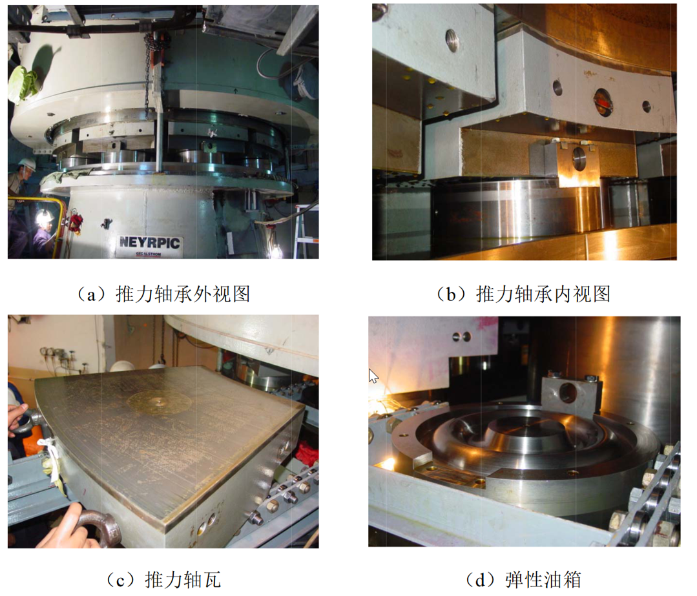
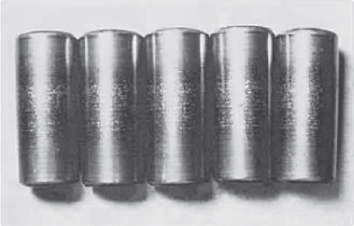
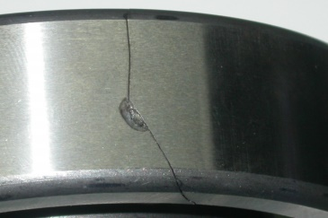

# 吊舱推进器推力轴承故障诊断方案

## 1. 吊舱推进器推力轴承故障模式、影响及危害性分析

吊舱推进器（Podded Propulsion Unit，POD）是现代高机动船舶广泛采用的一种先进推进装置，其通过将推进电机与螺旋桨集成于可旋转的吊舱内，实现360°全方位旋转控制，极大地提高了船舶的操纵性能与动态定位精度。在这一系统中，推力轴承是连接螺旋桨与船体结构的重要承力部件，主要作用是承受螺旋桨所产生的全部轴向推力，并将其平稳、均匀地传递至推进器外壳及船体结构。推力轴承同时还承担着维持轴系的轴向定位、减小摩擦、保障旋转平稳性以及与密封系统、润滑系统协同工作的多重功能，是吊舱推进系统中最为关键的机械元件之一。由于其承担的载荷大、环境复杂、维护难度高，因此推力轴承的健康状态直接决定了推进器乃至整船推进系统的运行可靠性和安全性。图1为吊舱推进器的推力轴承。

[原文图像或公式对象 image1.emf](../knowledge_assets/pod_thrust_bearing_plan/media/image1.png)

图1 吊舱推进器推力轴承

开展POD推力轴承的故障诊断研究具有十分重要的现实意义。首先，从船舶运行安全角度来看，推力轴承一旦出现故障，可能导致推进器推力输出下降、振动剧烈、噪声增加，甚至引发螺旋桨效率损失、轴系偏移、密封失效等连锁反应，使船舶丧失操纵性或发生偏航事故。对于采用动态定位（DP）系统或执行精密海上作业的船舶（如海洋工程船、科考船、邮轮和大型客滚船等），这类故障会严重威胁作业安全，甚至造成灾难性后果。其次，从经济与运维角度来看，POD通常位于水下，其维修或更换往往需要干船坞作业，成本高昂、周期长、停航损失巨大。若能够通过有效的故障诊断与预测维护技术实现早期识别与预防，可显著降低突发停机率，提升推进系统的可用性与寿命周期经济性。再次，从节能与环保角度看，轴承故障导致摩擦功耗上升与能效降低，会增加燃油消耗与碳排放，同时若密封破坏还可能造成润滑油泄漏，对海洋环境造成污染。因此，建立完善的推力轴承状态监测与智能诊断体系，不仅是保障船舶安全与降低运维成本的重要手段，也是响应国际海事组织（IMO）关于绿色航运与安全管理体系要求的重要技术支撑。图2为实际吊舱推进器的推力轴承。

图2 实际吊舱推进器的推力轴承

### 1.1 吊舱推进器推力轴承故障形式

吊舱推进器推力轴承的故障形式多样且复杂,根据故障特征和损伤机制的不同,可以分为多种类型。在正常航行中，常见的故障形式如下：

（1）磨损

磨损是推力轴承最常见的故障形式之一,包括正常磨损、异常磨损和磨粒磨损等类型。正常磨损是轴承在长期运转过程中不可避免的渐进性损伤,表现为轴承表面材料的缓慢流失和表面粗糙度的逐渐增加。异常磨损则是由于润滑不良、载荷过大或工况异常导致的加速磨损,磨损速率远超正常水平,会在短时间内造成严重损伤。磨粒磨损是由于润滑油中混入硬质颗粒物,如金属碎屑、砂石、锈蚀产物等,这些颗粒在轴承表面滚动或滑动时产生犁削作用,形成划痕和沟槽,加速轴承失效。图3展示了典型的轴承磨损样貌：

图3 典型的轴承磨损样貌

（2）点蚀

点蚀是推力轴承另一种重要的故障形式,主要发生在轴承的滚动接触表面。点蚀是一种疲劳破坏现象,在循环接触应力作用下,轴承表面或次表面产生疲劳裂纹,裂纹扩展后导致材料剥落,形成坑洞状的损伤。点蚀初期表现为表面出现细小的麻点,随着运行时间延长,麻点逐渐扩大并连成片,最终导致轴承表面大面积剥落。点蚀会显著增加轴承振动和噪声,降低承载能力,并可能引发连锁反应,导致更严重的故障。剥落性点蚀是更严重的形式,材料成块脱落,会造成轴承突然失效。图4为滚子点蚀的典型实例：

图4 滚子点蚀的典型实例

（3）裂纹

裂纹故障是威胁推力轴承安全的重要隐患,包括表面裂纹和次表面裂纹。裂纹的产生往往与材料缺陷、热处理不当、过载冲击或疲劳损伤有关。表面裂纹通常从轴承表面的应力集中部位萌生,如划痕、碰伤、腐蚀坑等缺陷处,在循环载荷作用下逐渐扩展。次表面裂纹则起源于材料内部的缺陷或最大剪应力位置,这种裂纹更难以发现,但危害性极大。裂纹扩展到一定程度后,可能导致轴承部件突然断裂,引发灾难性故障。网状裂纹是另一种形式,通常由热应力引起,表现为表面形成细密的裂纹网络,会导致材料逐渐剥落。图5是轴承表面裂纹的典型实例：

图5 轴承表面裂纹的典型实例

（4）腐蚀损伤

腐蚀损伤在吊舱推进器推力轴承中尤为突出,因为其工作环境与海水接触密切。腐蚀包括化学腐蚀和电化学腐蚀,海水中的氯离子具有强腐蚀性,能够破坏轴承材料表面的钝化膜,导致点蚀、缝隙腐蚀和应力腐蚀开裂。润滑油乳化或混入海水后,其润滑和防护性能大幅下降,加剧腐蚀过程。腐蚀产物会污染润滑油,形成磨粒,造成磨粒磨损。微动腐蚀是一种特殊的腐蚀磨损形式,发生在微小相对运动的接触表面,如配合面和连接面,表现为接触面出现红褐色的氧化物粉末。腐蚀损伤不仅直接削弱轴承强度,还会与其他故障形式相互促进,加速轴承失效。

（5）变形故障

变形故障也是不容忽视的问题,包括塑性变形、蠕变变形和热变形。塑性变形通常由过载或冲击载荷引起,表现为轴承表面出现压痕、凹陷或材料堆积。在启动、停车或突然改变工况时,瞬时过载可能导致局部塑性变形。蠕变变形是材料在高温和持续应力作用下发生的缓慢塑性变形,会改变轴承的几何形状和配合关系。热变形由温度场不均匀或热胀冷缩引起,可能导致轴承部件变形、配合松动或预紧力改变。此外,还有胶合故障,这是一种严重的黏着磨损,在润滑失效、局部高温或高速重载条件下,接触表面发生金属黏着和撕裂,形成胶合斑痕,表面严重损伤并可能导致轴承卡死。

（6）润滑系统相关故障

润滑系统相关故障也是导致推力轴承失效的重要因素,包括润滑油污染、润滑油劣化、润滑油泄漏和润滑油供应不足。润滑油污染可能来自外部侵入的水分、杂质或内部产生的磨损颗粒、氧化物。润滑油劣化是由于长期使用导致的性能衰退,表现为粘度变化、添加剂消耗、酸值升高和氧化产物增加。润滑油泄漏会导致油量不足,无法形成有效油膜。密封失效是吊舱推进器常见问题,可能导致海水侵入和润滑油外泄,严重影响轴承性能。

推力轴承故障的形成往往是多因素耦合的结果。除设计载荷与润滑条件外，环境因素（如温度、湿度、海水侵蚀、电化学环境）、操作习惯（如频繁反向操纵、高负荷低转速运行）以及维护不到位（如润滑油品老化未及时更换、密封件过期使用）均可能诱发故障。例如在海洋环境下，当密封性能下降、海水侵入轴承腔后，不仅润滑油会乳化失效，还会因盐分导致滚动体表面腐蚀凹坑，进而产生接触应力集中，加速疲劳裂纹萌生。又如，在推进器长期高载工况下，轴承内圈与滚道受到周期性轴向载荷作用，若润滑条件不良，滚动接触表面易形成微点蚀，导致疲劳剥落与微裂纹扩展，从而引起振动增大与温度升高。这些早期征兆若未被监测系统及时识别，极易演变为严重损伤乃至轴承失效。

### 1.2 推力轴承故障的影响

推力轴承的损伤对船舶健康航行的影响是多层面的。首先，它直接影响推进器的推力传递效率和方向稳定性，使船舶推力下降、舵效减弱，操纵性能显著恶化。其次，轴承的磨损与不对中会引起整条轴系的振动加剧，导致齿轮、密封及连接件的次生损伤，甚至形成结构共振，影响整个推进系统的动态稳定性。再次，轴承摩擦增大还会造成能效下降和燃油消耗上升，增加运营成本。此外，密封破坏造成的润滑油泄漏不仅加剧轴承损伤，还可能对海洋环境造成污染，违反国际防污染公约，带来经济与声誉风险。最为严重的情况是推力轴承发生突发性失效，导致推进器卡滞或停机，进而使船舶失去动力和操控能力，在恶劣海况或港口作业中可能引发搁浅、碰撞甚至人员伤亡事故。

从危害性角度分析，POD推力轴承故障属于高风险故障类型，其危害程度通常与故障发展速度、可检测性和维护响应能力密切相关。其中，海水侵入引起的润滑乳化与腐蚀被认为是最危险的模式之一，因其进展迅速且难以早期发现，常在短时间内导致轴承温度急剧上升和滚动体损坏。齿轮冲击导致的瞬态轴承破坏同样具有极高的严重度，一旦发生往往需要吊舱整体拆解维修。相对而言，油品老化或轻微磨损等慢性故障危害性较低，但发生概率高，若未及时维护亦可能演变为重大故障。总体而言，推力轴承的故障危害性高、可检测性低、维修成本昂贵，因此建立可靠的监测与诊断体系是确保吊舱推进系统安全运行的关键。

在故障可观测征兆方面，推力轴承通常会表现出振动信号异常、温度升高、油液特性变化、声发射频率异常及轴向位移波动等特征。振动分析是最直接的检测手段，通过监测轴承外圈故障频率（BPFO）、内圈故障频率（BPFI）及滚动体通过频率（FTF）等特征谱线，可早期识别滚动体裂纹与剥落。温度监测可反映摩擦与润滑状态变化，当油膜失效或局部烧结时，轴承温度会急剧升高。油液分析是另一重要手段，通过检测油中金属颗粒、水分含量、粘度及污染等级，可判断轴承磨损程度与密封完好性。近年来，声发射与超声检测技术也逐渐应用于轴承微裂纹与早期疲劳识别，其高频信号特征可用于早期诊断。此外，轴向力与位移传感器可实时监测推力传递状态，一旦出现异常偏移或载荷突变，往往预示轴承性能退化或结构损伤。

综上所述，POD推力轴承的故障不仅种类多、机理复杂、检测难度大，而且一旦发生将对船舶安全、经济性及环境造成严重影响。因此，在推进系统设计与运维阶段，应从源头上采取综合防护与监测措施，包括优化密封与防水设计、提升润滑系统可靠性、建立多参数在线监测体系（涵盖振动、温度、油液、水分、颗粒、轴向力等）、规范安装与对中工艺、制定定期油样化验与状态评估制度，并辅以运行载荷控制与数据驱动的预防性维护策略。通过上述措施，可显著降低推力轴承突发故障的概率，延长推进器寿命，提高船舶的安全性与经济性，全面提升船舶推进系统的可靠运行水平。

### 1.3 总体研究路线

本项目以“实验装置搭建—故障模拟—数据采集—特征提取—诊断分析”为主线，围绕吊舱推进器推力轴承的典型故障展开系统研究。总体研究路线分为五个阶段，逐步实现从实验条件构建到故障识别模型验证的完整过程。

（一）实验装置设计与搭建阶段

项目的首要任务是搭建一个能够真实再现吊舱推进器推力轴承运行工况的实验平台。主要工作包括：确定总体结构布局，保证轴承承受的载荷方向与实际船用推进系统一致；设计推力加载系统，采用液压或电动丝杆控制载荷，实现推力连续可调；集成多传感器接口，为振动、声发射、电流等信号采集提供安装位置；建立监控保护系统，实现实验过程的实时监测与安全防护。

这一阶段完成后，将形成一个可稳定运行、可重复使用的实验平台，为后续故障模拟与数据采集提供基础支撑。

（二）轴承故障加工与模拟阶段

为解决实际吊舱推进器故障样本稀缺、信号难以采集的问题，本阶段重点通过人工可控方式模拟典型轴承故障。根据工程中常见的失效模式，主要模拟以下几类：点蚀故障、裂纹故障、剥落故障、磨损故障等。实验过程中通过调节推力与转速，使这些缺陷逐步扩大，获取从初期损伤到严重失效全过程的动态信号，为后续故障识别提供丰富样本。

（三）数据采集与数据集构建阶段

在模拟不同类型和程度故障的实验中，利用安装在实验平台上的多种传感器对关键物理量进行同步采集。主要工作包括：多通道同步采集、多工况实验、数据清洗与分类标注、构建标准化数据集，为算法训练与验证提供高质量样本。

该阶段的成果将是一个包含多种故障形式、多运行工况、可重复验证的轴承故障实验数据库。

（四）信号处理与特征提取阶段

在完成数据采集后，开展系统的信号分析与特征提取工作。结合团队以往的技术积累，采用多种信号分析方法提取轴承的关键特征量。

主要研究内容包括：信号预处理与清洗：通过滤波、包络解调、平滑等方法去除背景噪声；传统特征提取、时频联合分析与信号分解、量子计算与传统特征提取方法结合：构建一种面向推力轴承故障诊断的量子时频域特征提取技术框架，突破传统方法在大规模数据下运算效率低、早期微弱故障特征难以凸显的瓶颈；通过上述步骤，能够获得不同故障类型下稳定且差异明显的特征参数，为智能识别提供高质量输入。

（五）故障分类识别算法开发阶段

在特征提取完成的基础上，开展故障识别算法的开发与验证工作，目标是实现对不同类型轴承故障的自动分类与识别。

主要研究内容包括：算法选择与构建：开发多套适用于推力轴承故障诊断的方法；模型训练与优化：利用前期构建的数据集进行训练，通过交叉验证、参数调整等方法提高模型识别准确率；特征重要性分析：分析不同特征对分类结果的贡献，优化特征选择方案；多工况下的鲁棒性验证：在不同载荷、转速条件下测试算法的稳定性，验证其适应性与普适性。

该阶段的研究成果将形成一套可直接用于实验平台乃至实际系统的智能故障识别算法体系，为吊舱推进器的健康监测与状态评估提供技术支撑。

本项目的总体研究路线如图6所示：

[原文图像或公式对象 image6.emf](../knowledge_assets/pod_thrust_bearing_plan/media/image6.png)

图6 研究总体路线图
