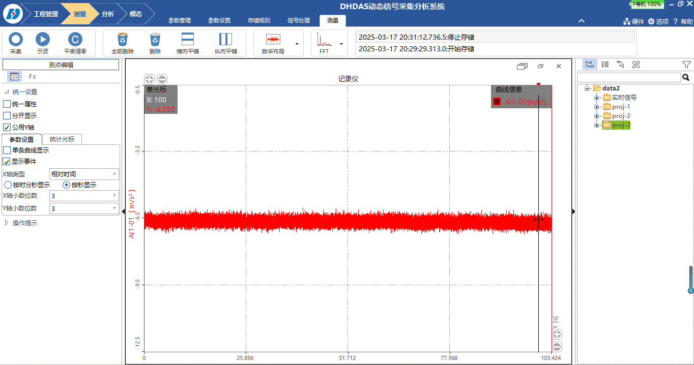
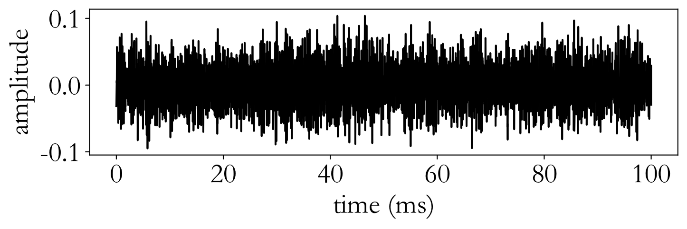

# 吊舱推进器推力轴承故障诊断方案

## 4. 数据采集与数据集构建

### 4.1 研究内容

（1）建立多工况轴承故障数据采集体系

为了完整反映吊舱推进器推力轴承在不同故障状态下的运行特征，需要构建一个可在多种工况（不同转速、载荷、润滑条件）下运行的实验数据采集系统。该系统应同时采集振动信号、温度信号、噪声信号以及电机电流信号等多源数据。在具体操作上，可在实验台的关键位置安装振动加速度传感器、温度传感器以及电流传感器，并使用数据采集卡将所有信号同步采集。通过统一采样系统和时间同步控制，实现不同类型信号的时域对齐，从而便于后期数据分析与建模。

（2）构建标准化故障数据集

针对前期加工得到的多种轴承故障样本（如点蚀、裂纹、磨损、剥落等），在实验装置上分别运行并采集其在不同工况下的信号数据，形成标准化的故障数据集。采集到的数据应包括：

故障类型（例如点蚀、裂纹等）；

工况条件（转速、载荷、润滑状态）；

多种信号（振动、温度、噪声、电流）；

运行时长与状态变化记录。

通过规范化命名与统一格式存储，为后续的故障特征提取和算法训练提供高质量的基础数据支持。

（3）实现数据清洗与标注

在实验采集过程中可能存在传感器漂移、噪声干扰、信号缺失等问题，因此需要在采集后对数据进行清洗、分段和标注。这一步主要包括：去除无效数据段、过滤明显异常的高频噪声、剔除非运行状态的数据，并结合实验记录手册（包含故障类型、采集时间、工况设置）对每组数据进行人工标注。最终形成结构清晰、标签准确的多工况轴承故障数据集。

### 4.2 拟解决的关键科学问题

（1）如何保证采集到的数据真实反映轴承故障特征

实验室环境与真实海上运行环境存在差异，例如载荷分布、振动方向、油液条件等都会不同。因此，首要科学问题是如何在可控实验台中复现与实际设备相匹配的信号特征。为解决这一问题，本研究将通过精确控制推力载荷、转速和润滑状态来逼近真实工况。通过对退役轴承或已有文献数据的对比，校准实验采集系统的信号幅值与频率响应，使其具备与真实设备相近的动态特性。这样获得的数据既安全可控，又足够真实，能够用于算法开发与模型训练。

（2）如何在不同故障类型下获取清晰、可分辨的信号特征

不同故障（如点蚀、裂纹、磨损）产生的信号差异往往较微弱，容易被机械噪声或电机振动掩盖。实验中如果采样策略或传感器位置不当，就会导致信号特征不明显。为此，需要系统研究不同故障类型的主要信号分布特征（例如振动频段、冲击周期），并在轴承附近选择合适的传感器安装点和采样方式。同时，在采集阶段采用多种信号类型（如振动、噪声、电流）相互验证，从而获得更加全面、可区分度高的故障信号。

（3）如何设计合理的工况组合以确保数据的全面性

吊舱推进器的推力轴承在实际使用中会经历不同转速、载荷、温度、润滑状态等多种工况。若实验仅在单一工况下采集数据，所得信号将缺乏代表性。为此，需要在实验方案中系统设计工况组合，例如：不同转速（低、中、高速），不同载荷水平（轻载、中载、重载），以及不同润滑状态（正常、轻微缺油）。通过多条件交叉实验采集信号，确保数据集覆盖轴承可能遇到的主要运行状态。

（4）如何处理采集过程中出现的噪声和异常信号

在实际实验中，环境噪声、电机电磁干扰、传感器松动等都可能造成数据污染。为此，将建立数据质量监控机制：在每次采集前后进行信号检测，如发现明显异常（噪声过大或波形失真），立即检查设备状态并重新采集。后期还将通过数据清洗方法（如滤波、异常点剔除等）提高数据的可用性与稳定性。

### 4.3 研究路线

#### 4.3.1 搭建多信号同步采集系统

首先，根据推力轴承的结构特征，在实验装置上安装多个传感器，包括振动传感器、温度传感器、噪声传感器和电流传感器。所有传感器的信号统一接入一台多通道数据采集仪，并通过同一主控系统进行时间同步控制。在系统搭建完成后，通过空载测试和基础运行验证采集系统的稳定性，检查传感器安装是否牢固、信号是否清晰无干扰。

#### 4.3.2 制定多工况数据采集方案

根据前期确定的故障类型（点蚀、裂纹、磨损等），为每种故障样本设计若干实验工况。实验方案包括不同的转速、载荷及润滑条件，以确保采集的数据覆盖全面。每一组实验需保持固定的采样时间，并记录运行状态、温度变化和声音特征。同时，通过对比不同工况下同一故障的信号变化，初步建立“工况—信号特征”之间的关系。

#### 4.3.3 进行系统化数据采集与存储

实验正式运行时，启动多通道采集系统同步记录所有信号，并实时监控波形变化。数据采集结束后，立即将所有原始数据保存至数据库中，按照“故障类型—工况—样本编号”的结构进行分类整理。同时，记录运行日志，包括时间、环境温度、载荷值、运行时长等，保证后期数据分析时能快速溯源。

#### 4.3.4 开展数据清洗、分段与标注工作

在采集完成后，对数据进行清洗处理，剔除噪声段和无效段。例如：在启动或停机阶段信号波动较大，可单独标记；在稳定运行阶段截取高质量信号段。之后结合实验记录进行标注，将每段数据对应到具体的故障类型、工况条件和运行时长，并统一命名和编号。这样便于后续分析、建模或机器学习使用。

#### 4.3.5 建立标准化数据集并进行验证

所有清洗标注后的信号统一存入标准化数据库，形成可直接调用的数据集。
随后对部分样本重复试验，比较同一工况下的数据一致性，从而评估数据集的可靠性。若发现同类样本差异较大，则需重新检查传感器状态或实验装置是否存在偏差。

#### 4.3.6 形成最终数据集与可视化成果

在数据采集、清洗、标注与扩充工作完成后，将所有数据进行整合，形成标准化、多工况的推力轴承故障数据集。同时开发简单的可视化界面，用于浏览不同故障信号的变化趋势和特征波形，便于研究人员快速理解数据结构与规律。最终的数据集可直接用于后续的信号特征提取、算法验证和模型训练。

### 4.4 已完成的工作

#### 4.4.1 推力圆柱滚子轴承故障数据采集

团队针对第二章介绍的推理圆柱滚子轴承实验台，进行了数据采集工作，具体介绍如下：

数据采集系统采用东华动态信号采集分析系统。东华动态信号采集分析系统由控制单元、数据采集仪、传感器及相关软件部分构成。控制单元采用内置PC/104嵌入式工控机，搭配智能化管理的可充电锂电池组供电，数据采集仪具有多个通道，支持DC、AC、GND、IEPE等多种输入方式。传感器使用东华1A702E型号加速度传感器，数据采集仪型号为DH5902G，如图9所示.

|  |  |
| --- | --- |
| (a) 加速度传感器 | (b) 数据采集仪 |

图9 加速度传感器与数据采集仪

东华动态信号采集分析软件可对采集到的数据进行预处理，包含经典滤波、去直流、平滑等各种分析计算功能，还能自动统计各通道的最大值、最小值、平均值等信息。所有曲线可同步显示，也能够独立全屏观察任意一条曲线，同时支持选择x-y函数形式显示曲线以及显示多种频谱图，软件显示界面如图10所示。

图10 东华动态信号采集分析系统显示界面

#### 4.4.2 管道泄漏声发射数据采集

团队针对管道泄漏声发射模拟实验台进行了数据采集，具体描述如下：

采用的是型号为PCI-2的声发射检测装置，由美国物理声学公司（PAC）制造。此装置具备广泛而精细的采样频率区间，涵盖1kHz至3MHz，并内建有高效数据存储功能，可在硬盘上以每秒10兆采样点的速度存储声发射波形信息。

数据采集阶段，利用与PCI-2装置配套的AEwin软件进行操作与控制，实验中选用的传感器为R15型，其特征为中心频率设定为150kHz。

为进一步优化信号质量，增强信号与噪声之间的对比度，本实验配置了2/4/6通道的前置放大器，其增益分别可调节至20/40/60dB。采集到的信号波形如图11所示：

图11 实验室泄漏信号波形

另外，团队还将海洋平台的真实环境背景噪声信号注入泄露信号中，使得构建的数据集更加贴合实际。团队选取了海洋平台19米和29米平台处的管道，采集了对应的背景噪声信号并进行了融入，其波形图如图12所示：

|  |  |
| --- | --- |
| (a) 19米平台管道噪声融入 | (b) 29米平台管道噪声融入 |

图12 海洋平台噪声融入后的泄露信号

综上所述，团队已经在推理圆柱滚子轴承故障信号以及管道泄漏信号方面积累了丰富的数据采集经验，这些经验能够直接应用于该项目中，促进项目的尽快实施。
