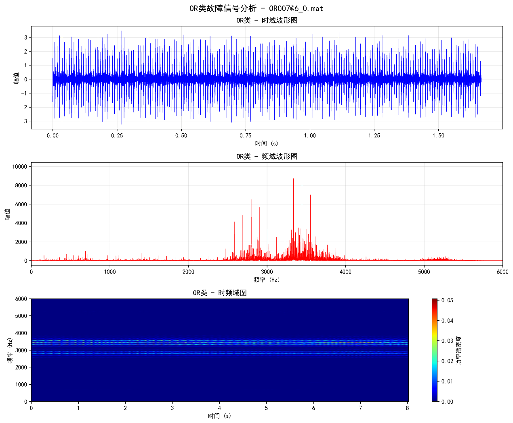

# 吊舱推进器推力轴承故障诊断方案

## 5. 信号处理与特征提取阶段

### 5.1 研究内容

本阶段的研究工作主要分为以下几个方面：

（1）信号预处理与去噪

在实际采集过程中，信号往往包含大量机械噪声和环境干扰。本部分的工作重点是通过信号预处理，去除噪声、增强有效成分，为后续分析打下基础。主要采用滤波、包络分析和平滑处理等方法，确保信号清晰、稳定。

（2）时域与频域特征提取

通过计算振动信号在时域和频域中的变化规律，提取平均值、峰值、方差、频谱能量等关键指标。这些特征能够直观反映轴承在不同故障状态下的能量分布与振动模式变化，便于后续分类和识别。

（3）时频联合分析与信号分解

针对推力轴承信号非平稳、周期变化复杂的特点，本项目将采用经验模态分解（EEMD）和变分模态分解（VMD）等方法，将复杂信号分解为若干个本征模态分量（IMF），并提取各分量的能量、频率等特征。这样能够更准确地捕捉到局部故障导致的短时变化。

（4）基于量子计算的特征提取方法研究

在传统信号处理的基础上，引入量子计算的思想与方法。通过量子叠加态实现多特征的并行计算，利用量子干涉机制提高特征分离能力。例如，可以利用“量子特征映射”对信号特征空间进行扩展，使得不同故障模式在高维量子空间中更易被区分。这项研究将探索“量子辅助特征提取（Quantum-enhanced Feature Extraction）”的可行性，为后续智能识别提供更高精度的输入特征。

### 5.2 拟解决的关键科学问题

（1）如何从复杂的原始信号中提取出能够准确反映故障状态的关键特征

轴承信号通常包含噪声和非线性成分，不同故障类型在信号表现上差异微小，传统方法往往难以清晰分离这些差异。本项目通过信号分解和时频分析方法，将复杂信号分解为不同频率层级的成分，从而找到与故障特征频率相对应的信号分量，使得故障特征更易被识别。

（2）如何提高特征提取过程的效率与准确性

在多工况、多传感器条件下，信号量巨大、维度高，特征提取过程容易出现冗余或重复计算。本项目将研究一种结合量子计算并行特性的特征提取框架，通过量子态的叠加实现特征的同时计算，从而显著提升处理速度。同时，借助量子干涉效应提高特征区分度，使不同故障模式更容易被算法识别。

（3）如何确保提取的特征具有良好的稳定性与可区分性

在不同载荷、转速或润滑状态下，同一类型的故障信号特征可能存在差异。为此，本项目通过融合多种特征类型（时域、频域、时频域及量子特征），建立特征冗余度较低、抗干扰能力强的综合特征体系，确保在多工况下依然保持高稳定性。

（4）如何实现传统特征提取与量子计算方法的有效融合

这是本项目的一个创新点，也是难点。量子计算需要将传统信号数据编码为量子态，再通过量子特征映射或量子电路运算实现特征变换。本项目将探索一种“半量子”混合方式，即在传统信号处理后将关键特征向量映射到量子空间中进行优化处理，既保持计算简单可行，又能充分利用量子算法的高效搜索与计算能力。

### 5.3 研究路线

为实现对推力轴承故障信号的高质量特征提取，本阶段研究路线主要包括信号预处理、传统特征提取、时频联合分析、量子计算辅助特征提取等四个环节。各环节既相互衔接，又各自承担特定功能，形成完整、可执行的研究路径。其具体研究路线如图13所示：

[原文图像或公式对象 image18.emf](../knowledge_assets/pod_thrust_bearing_plan/media/image18.png)

图13 面向推力轴承的量子增强时频域特征提取方法技术路线

具体研究路线如下：

#### 5.3.1 信号预处理与清洗

在这一阶段，主要任务是对实验采集到的原始信号进行质量提升，使其能够更准确地反映轴承的真实运行状态。由于实验环境中不可避免存在噪声、干扰或非工作段信号，因此需要首先进行数据清洗。具体做法包括使用带通滤波或小波去噪等方法，去除环境噪声和高频干扰信号；同时对采集信号进行归一化处理，使不同通道、不同工况下的信号保持统一量级，便于后续特征计算。此外，还将对信号进行分段和截取处理，保留轴承稳定运行阶段的数据，避免启动或停机阶段引入的非特征性干扰。通过该步骤，可确保后续分析数据干净、稳定，为特征提取奠定可靠基础。

#### 5.3.2 传统特征提取

信号清洗完成后，将提取时域和频域的统计特征，以初步描述轴承的健康与故障状态。在时域方面，将计算信号的均方根值、峰值、峭度、偏度等常用指标，这些特征可以直观反映振动幅度和冲击特性，对轴承早期故障尤其敏感；在频域方面，将通过快速傅里叶变换（FFT）将信号转化为频谱形式，分析主频位置、幅值分布、能量集中区及带宽变化情况。通过多组实验信号的对比，可以识别出频谱结构变化与不同故障模式的对应关系。这一阶段的目标是形成包含基础统计信息的传统特征集，为后续的高级分析提供初步参考。

#### 5.3.3 时频联合分析与信号分解

考虑到推力轴承在运行过程中会受到载荷波动、水动力扰动等影响，信号具有明显的非平稳特性，仅依靠时域或频域特征难以完整描述其变化规律。因此，本阶段将采用时频联合分析方法，通过信号分解和多尺度分析提取更加细致的特征。具体而言，将使用经验模态分解（EEMD）和变分模态分解（VMD）等方法，将原始信号分解为若干个本征模态函数（IMF），每个模态代表不同的频率成分。通过对各模态的瞬时能量、包络谱以及瞬时频率进行分析，可以揭示信号在时间与频率两个维度上的变化趋势。结合短时傅里叶变换（STFT）或连续小波变换（CWT），进一步生成时频分布图，清晰展示故障信号在不同时间区间的能量集中区域。该过程能够帮助研究人员判断故障出现的时间段与特征变化规律，为后续特征提取提供更精准的数据基础。

#### 5.3.4 量子计算辅助特征提取

在完成传统特征与时频特征提取后，本项目将创新性地引入量子计算思想，以提高特征提取的效率和敏感度。具体而言，将把传统特征数据映射到量子态空间中，通过量子叠加和量子干涉机制，实现多维特征的并行计算与快速优化。在传统特征提取中，多个信号维度往往需要逐一计算，而在量子特征提取中，利用量子叠加特性可以同时对多个特征进行处理，大幅提升计算效率。同时，量子干涉机制可用于增强不同特征之间的差异，使得不同故障状态在量子特征空间中的分布更加明显、区分度更高。最后，通过量子测量与解码步骤，将得到的量子态信息转换为“量子增强特征”，即在传统特征基础上进一步优化后的高维特征向量。这一环节的研究不仅提升了特征提取的效率，也为探索量子计算在机械故障诊断中的应用奠定了基础。

#### 5.3.5 要提取的特征

##### 5.3.5.1 时域特征

时域特征是直接基于信号在时间序列上的变化情况提取的统计量，用于描述信号在时间维度上的整体形态和动态特征。它们不经过频域或时频域变换，而是直接从原始波形中计算得到，能够反映信号的平均水平、波动强度、极值分布以及冲击特性等。通过分析时域特征，可以从能量、形态和对称性等角度判断信号的稳定性与异常状态，是机械振动分析、故障诊断、语音识别等领域最基础、最直观的特征类型之一。本实验中，需要提取的时域特征主要有以下几个：

（1） 均值

均值是信号在整个时间段内的平均值，也就是所有采样点求和后除以采样点个数。它反映了信号的整体水平或中心趋势，可以理解为信号在纵轴上的“平衡点”。其计算公式为

[原文图像或公式对象 image19.wmf](../knowledge_assets/pod_thrust_bearing_plan/media/image19.png)

(1)

公式（1）线性转写：`$\bar{x}=\frac{1}{N}\sum_{n=1}^{N}x(n)$`

[原文图像或公式对象 image20.wmf](../knowledge_assets/pod_thrust_bearing_plan/media/image20.png)
[原文图像或公式对象 image21.wmf](../knowledge_assets/pod_thrust_bearing_plan/media/image21.png)

式中，为信号分量序列，为样本点数，下同。

(2) 标准差

标准差反映信号样本的离散程度或波动强度，是均值附近波动幅度的平均水平。标准差越大，说明信号波动越剧烈、能量越分散；标准差越小，则说明信号更平稳、变化较小。标准差可以用来表示机器振动强度或运行稳定性，是衡量信号总体能量的重要指标之一。其计算公式为：

[原文图像或公式对象 image22.wmf](../knowledge_assets/pod_thrust_bearing_plan/media/image22.png)

(2)

公式（2）线性转写：`$\sigma_x=\sqrt{\frac{1}{N-1}\sum_{n=1}^{N}(x(n)-\bar{x})^2}$`

(3) 最小值

最小值是信号在时间序列中出现的最低点，反映信号的负向极限。在实际分析中，最小值可用于判断信号是否出现过瞬时极端负波动，例如冲击信号的负峰或振动波谷。它常与最大值配合使用，用于衡量信号的整体范围和极端变化情况。其计算公式为：

[原文图像或公式对象 image23.wmf](../knowledge_assets/pod_thrust_bearing_plan/media/image23.png)

(3)

公式（3）线性转写：`$x_{min}=\min(x(n))$`

(4) 最大值

最大值表示信号在整个时间序列中出现的最高点，是信号瞬时强度的极端值。它能反映信号中是否存在冲击、故障瞬变或异常峰值。若最大值突然增大，往往意味着出现短时的高幅度振动或碰撞。其计算公式为：

[原文图像或公式对象 image24.wmf](../knowledge_assets/pod_thrust_bearing_plan/media/image24.png)

(4)

公式（4）线性转写：`$x_{max}=\max(x(n))$`

(5) 均方根值

均方根值是信号平方的平均值再开平方，体现的是信号的有效能量或功率水平。它与能量直接相关：RMS 越大，说明信号能量越强。RMS 常用于表示“等效能量强度”，例如振动强度等。相比均值，RMS 更能反映信号总体功率特性，是工程监测中最常用的指标之一。其计算公式为：

[原文图像或公式对象 image25.wmf](../knowledge_assets/pod_thrust_bearing_plan/media/image25.png)

(5)

公式（5）线性转写：`$x_{rms}=\sqrt{\frac{1}{N}\sum_{n=1}^{N}x^2(n)}$`

(6) 偏度

偏度描述信号概率分布相对于均值的对称性。当偏度为 0 时，表示信号分布左右对称；偏度为正说明信号分布右偏，存在更多的正峰；偏度为负则表示左偏，有更多负峰。偏度的变化可以反映信号中是否存在单向冲击或偏振现象。例如在轴承振动信号中，偏度增加可能表示出现了不对称冲击或局部故障。其计算公式为：

[原文图像或公式对象 image26.wmf](../knowledge_assets/pod_thrust_bearing_plan/media/image26.png)

(6)

公式（6）线性转写：`$S=\frac{\sum_{n=1}^{N}(x(n)-\bar{x})^3}{(N-1)\sigma_x^3}$`

(7) 峰度

峰度用于衡量信号分布的“尖锐程度”或“脉冲性”。当信号分布比较平坦时，峰度较低（接近 3 表示接近正态分布）；当信号中存在尖锐的冲击或突变时，峰度值会显著增大。因此峰度常被用作冲击检测或故障识别特征。在机械诊断中，轴承或齿轮出现微小裂纹时，波形会出现短暂高幅值尖峰，导致峰度上升，是一个非常敏感的早期故障特征。其计算公式为：

[原文图像或公式对象 image27.wmf](../knowledge_assets/pod_thrust_bearing_plan/media/image27.png)

(7)

公式（7）线性转写：`$K=\frac{\sum_{n=1}^{N}(x(n)-\bar{x})^4}{(N-1)\sigma_x^4}-3$`

(8) 峰值

峰值是信号在正负方向上的绝对最大幅度（即最大绝对值）。它表示信号在某一时刻的最大瞬态强度，直观地反映了信号可能达到的最大冲击幅度。峰值过大通常意味着存在异常的高能量事件，比如碰撞、击打或断续接触。在实际应用中，峰值可以帮助识别短时高幅度事件，例如电流突变或机械撞击。其计算公式为：

[原文图像或公式对象 image28.wmf](../knowledge_assets/pod_thrust_bearing_plan/media/image28.png)

(8)

公式（8）线性转写：`$C=\frac{\max|x(n)|}{x_{rms}}$`

(9) 裕度

裕度是峰值与均方根值的比值。它衡量的是信号中峰值相对于整体能量的突出程度。若裕度较大，表示信号虽然整体能量不高，但存在明显峰值或冲击；裕度较小则说明信号较平稳，峰值与平均能量接近。在故障诊断中，裕度常用于识别信号中的短暂异常峰，例如轴承滚动体撞击缺陷点时的冲击。其计算公式为：

[原文图像或公式对象 image29.wmf](../knowledge_assets/pod_thrust_bearing_plan/media/image29.png)

(9)

公式（9）线性转写：`$L=\frac{\max|x(n)|}{(\frac{1}{N}\sum_{n=1}^{N}\sqrt{|x(n)|})^3}$`

(10) 脉冲指标

脉冲指标是峰值与信号平均绝对值的比值。它描述了信号中最大瞬时幅度与平均幅度之间的对比关系。脉冲指标越大，说明信号中出现的峰值越“突兀”、越不平滑，通常意味着存在明显的脉冲性干扰或冲击成分。在振动分析中，这一指标经常与峰度结合使用，用于检测早期机械故障或周期性冲击信号。其计算公式为：

[原文图像或公式对象 image30.wmf](../knowledge_assets/pod_thrust_bearing_plan/media/image30.png)

(10)

公式（10）线性转写：`$I=\frac{\max|x(n)|}{\bar{x}}$`

##### 5.3.5.2 频域特征

频域特征是通过对信号进行傅里叶变换（FFT）后，从其频谱中提取的统计特征，用于描述信号在不同频率成分上的分布规律。与时域特征直接反映信号随时间变化的形态不同，频域特征强调信号能量在频率空间的分布特性，能够揭示信号的主频、能量集中区域以及频谱形态。这些特征在机械振动分析、语音信号处理、结构健康监测等领域中非常重要，可用于判断设备运行状态、识别周期性振动特征或检测潜在故障。本实验中，需要提取的时域特征主要有以下几个：

(1) 频谱均值

频谱均值是频谱分布的平均频率，表示信号能量在频率轴上的“重心”位置。它反映了信号中主要能量成分的平均频率水平。若频谱均值较高，说明信号高频成分占比较多；若较低，则信号主要集中在低频区域。在机械故障分析中，频谱均值可以用于判断系统是否出现了高频振动或噪声增强。其计算公式为：

[原文图像或公式对象 image31.wmf](../knowledge_assets/pod_thrust_bearing_plan/media/image31.png)

(11)

公式（11）线性转写：`$F_1=\frac{1}{K}\sum_{k=1}^{K}s(k)$`

(2) 频谱标准差

频谱标准差表示频谱能量分布在频率上的离散程度，衡量信号频率成分的分布宽度。频谱标准差越大，说明能量分布越广，信号中包含的频率成分越丰富；反之则意味着信号集中在某一窄频带内。它反映信号复杂度与频谱扩展性，是描述频域“带宽”的重要指标。其计算公式为：

[原文图像或公式对象 image32.wmf](../knowledge_assets/pod_thrust_bearing_plan/media/image32.png)

(12)

公式（12）线性转写：`$F_2=\sqrt{\frac{1}{K}\sum_{k=1}^{K}(|s(k)|-F_1)^2}$`

(3) 频谱能量

频谱能量是信号在频域中的总能量，通常通过频谱幅值平方求和得到。它表示信号在整个频率范围内的总体能量强度。频谱能量可以反映系统的整体振动水平或功率大小，常用于比较不同状态下信号能量变化，比如正常与故障工况的差异。其计算公式为：

[原文图像或公式对象 image33.wmf](../knowledge_assets/pod_thrust_bearing_plan/media/image33.png)

(13)

公式（13）线性转写：`$F_3=\frac{\sum_{k=1}^{K}|s(k)|^2}{K}$`

(4) 频谱中心

频谱中心是频谱“质心”位置的另一种表示方式，也称为频率重心。它反映信号的平均能量分布频率，即能量在频谱上的平衡点。在音频处理中，频谱中心常被认为与“声音明亮度”相关；在机械信号中，频谱中心上移可能表示出现高频振动或部件磨损。其计算公式为：

[原文图像或公式对象 image34.wmf](../knowledge_assets/pod_thrust_bearing_plan/media/image34.png)

(14)

公式（14）线性转写：`$F_5=\frac{\sum_{k=1}^{K}k|s(k)|}{\sum_{k=1}^{K}|s(k)|}$`

(5) 频谱平坦度

频谱平坦度用于衡量频谱分布的平滑程度或随机性，计算公式为几何平均值与算术平均值之比。当频谱平坦度接近 1 时，说明信号频率分布均匀、类似噪声；当值较小（趋近于 0）时，说明频谱集中在少数频率上，具有明显的周期性或谐波特征。因此，它可以反映信号的“调谐性”与“随机性”之间的差异。其计算公式为：

[原文图像或公式对象 image35.wmf](../knowledge_assets/pod_thrust_bearing_plan/media/image35.png)

(15)

公式（15）线性转写：`$F_4=\frac{\exp(\frac{1}{K}\sum_{k=1}^{K}\ln|s(k)|)}{\frac{1}{K}\sum_{k=1}^{K}|s(k)|}$`

(6) 频谱滚降点

频谱滚降点是指累计频谱能量达到某一百分比（通常为 85% 或 95%）时对应的频率。它代表信号能量集中区域的上限，用来衡量信号频谱的高频延伸程度。滚降点越高，说明信号能量分布到更高频率，通常表示系统产生了高频振动或噪声。其计算公式为：

[原文图像或公式对象 image36.wmf](../knowledge_assets/pod_thrust_bearing_plan/media/image36.png)

(16)

公式（16）线性转写：`$F_6=\sum_{k=1}^{\lfloor0.85K\rfloor}|s(k)|$`

(7) 频谱偏度

频谱偏度描述频谱能量分布的非对称性。当偏度为正时，频谱右偏（能量更多集中在低频区）；当偏度为负时，频谱左偏（能量集中在高频区）。它可以反映信号中能量分布的倾向性，用于判断信号主要集中在哪一侧频段。其计算公式为：

[原文图像或公式对象 image37.wmf](../knowledge_assets/pod_thrust_bearing_plan/media/image37.png)

(17)

公式（17）线性转写：`$F_7=\frac{K\sum_{k=1}^{K}(|s(k)|-F_1)^3}{(K-1)(K-2)F_2^3}$`

(8) 频率峰度

频谱峰度反映频谱分布的尖锐程度或集中程度。高峰度表示频谱能量集中在少数几个频率点上，说明信号具有明显的周期性或冲击特征；低峰度则表明频谱较为平滑、能量分散。在机械故障诊断中，频谱峰度常用于识别冲击或周期性激励，是检测早期故障的重要指标之一。其计算公式为：

[原文图像或公式对象 image38.wmf](../knowledge_assets/pod_thrust_bearing_plan/media/image38.png)

(18)

公式（18）线性转写：`$F_7=\frac{K\sum_{k=1}^{K}(|s(k)|-F_1)^4}{(K-1)F_2^4}-3$`

(9) 频谱下降

频谱下降描述频谱能量随频率上升而衰减的趋势。通常通过线性拟合频谱幅度随频率变化的斜率得到。斜率较大表示信号能量主要集中在低频，高频成分衰减明显；斜率较小则说明高频成分较多，信号变化更剧烈。它能反映信号频率分布的整体趋势。其计算公式为：

[原文图像或公式对象 image39.wmf](../knowledge_assets/pod_thrust_bearing_plan/media/image39.png)

(19)

公式（19）线性转写：`$F_9=\frac{1}{K-1}\sum_{k=1}^{K-1}\frac{|s(k+1)|-|s(k)|}{|s(k)|}$`

(10) 变异系数

频谱变异系数是频谱标准差与频谱均值的比值，表示频谱能量分布的相对离散程度。它反映了信号频谱的不稳定性或复杂性。较高的变异系数表明频谱结构多变、能量分散；较低的则说明频谱集中且规律性强。在状态监测中，该指标常用于评估信号频率结构的变化敏感度。其计算公式为：

[原文图像或公式对象 image40.wmf](../knowledge_assets/pod_thrust_bearing_plan/media/image40.png)

(20)

公式（20）线性转写：`$F_{10}=\frac{\sqrt{\frac{1}{K}\sum_{k=1}^{K}(|s(k)|-F_1)^2}}{F_1}$`

### 5.4 已完成的工作

#### 5.4.1 推力圆柱滚子轴承故障特征提取

团队针对传统变分模态分解VMD方法在模态数量确定、保真度系数设定及惩罚参数选择等方面仍存在一定局限性的问题，为进一步提升VMD方法的性能和适用性，提出一种基于相关系数的模态数量确定方法，并引入孔雀优化算法对保真度系数和惩罚参数进行寻优，从而实现对VMD方法的改进与优化，称为最有变分模态分解(OVMD)方法。目前，该方法已经成功获得国家发明专利。

团队还成功使用经典的直接基于信号的时间序列数据（原始波形）计算统计特征的方法提取出了轴承的时域特征，使用经典的快速傅里叶变换提取出了轴承的频域特征，提取出的外圈故障时域和频域波形图如图14所示：

图14 推力圆柱滚子轴承外圈故障的时域和频域波形图

#### 5.4.2 管道泄漏故障信号特征提取

团队成功复现了多种经典方法对管道泄漏的故障信号进行了特征提取，包括经验模态分解(EEMD)，变分模态分解(VMD)等。分解出的前四阶信号如图15和图16所示：

|  |  |
| --- | --- |
|  |  |
|  |  |
|  |  |
|  |  |
| (a) 含噪泄漏信号 | (b) 实测噪声信号 |

图15 EEMD分解前4阶信号

|  |  |
| --- | --- |
|  |  |
|  |  |
|  |  |
|  |  |
| (a) 含噪泄漏信号 | (b) 实测噪声信号 |

图16 VMD分解前4阶信号

综上所述，项目团队在轴承与管道系统信号分析方面已形成较为成熟的研究体系，掌握了多种先进的特征提取方法和实验验证手段。无论在算法层面（OVMD、EEMD、VMD、FFT 等），还是在实验平台搭建与数据分析方面，团队均具备丰富的经验与成熟的技术储备。这些前期成果充分证明团队具备承担“吊舱推进器推力轴承故障模拟与诊断研究”项目的研究基础与技术能力，可确保项目顺利实施并取得预期成效。
