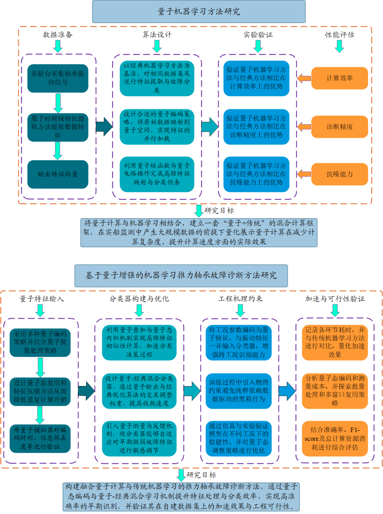
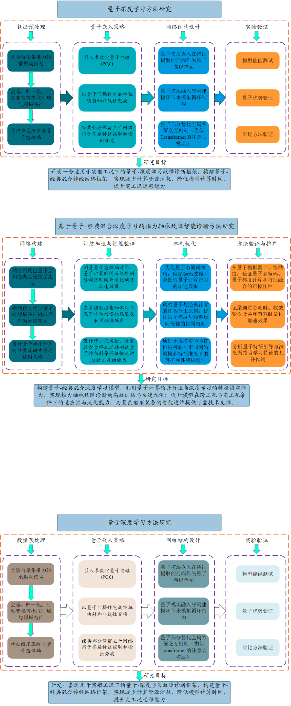
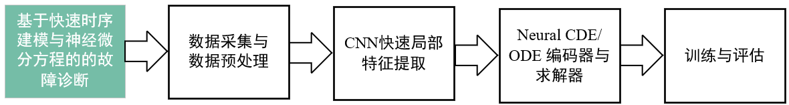
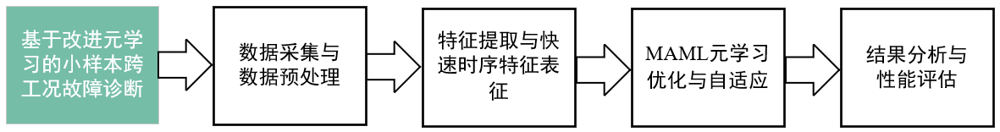
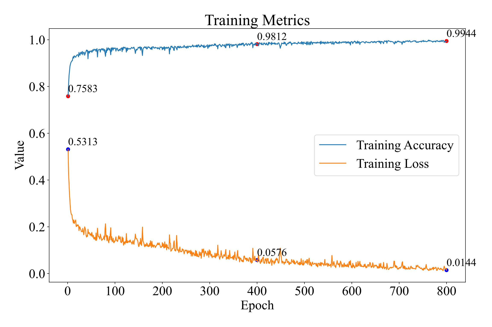
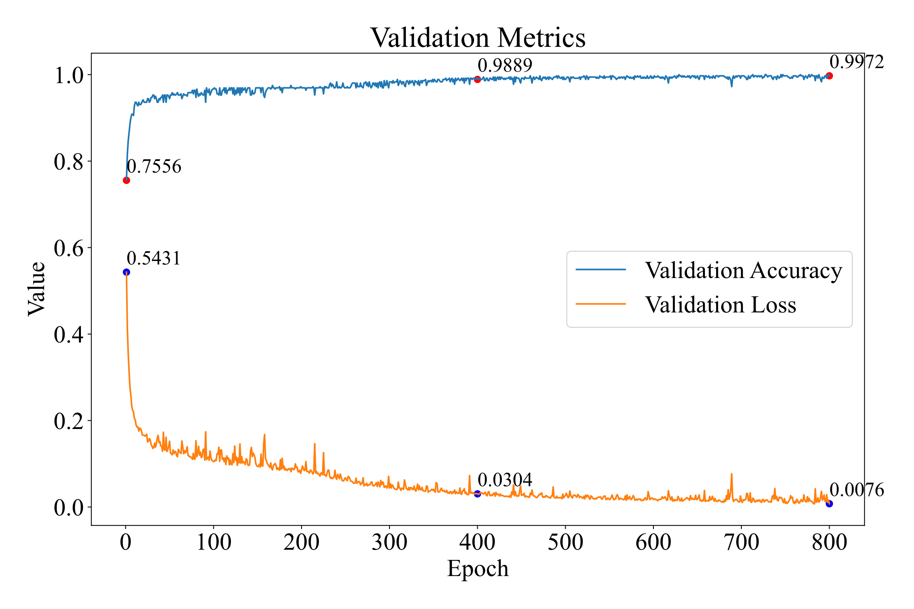
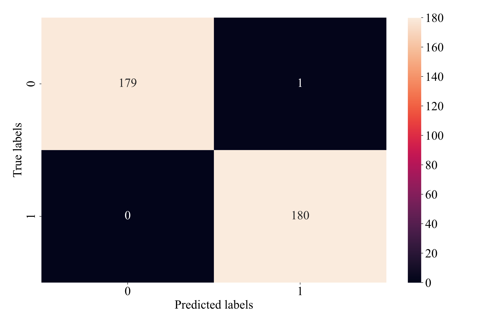

# 吊舱推进器推力轴承故障诊断方案

## 6. 故障分类识别算法开发

### 6.1 基于量子增强的机器学习推力轴承故障诊断方法研究

#### 6.1.1 研究内容

在船舶动力系统中，推力轴承长期处于高转速、变载荷和复杂海洋环境下，产生的故障信号往往具有非线性、强噪声和多尺度特征。传统的机器学习方法（如支持向量机、K近邻、随机森林等）在特征提取和分类方面取得了较好效果，但随着数据规模和模型复杂度的增加，其计算成本和训练时间迅速上升，尤其在实时监测和跨工况诊断的场景中，面临难以满足高效运算和快速响应的挑战。量子计算以量子叠加和量子并行为核心特性，为机器学习提供了潜在的指数级加速能力，为大规模轴承故障诊断带来新的技术突破。

在前期完成量子特征提取方法研究的基础上，本研究将进一步探索量子机器学习方法在推力轴承故障诊断中的应用。研究内容主要包括以下几个方面：

首先，将量子特征提取得到的特征值与机器学习方法结合，构建量子辅助的故障诊断模型。具体而言，量子特征向量将作为输入，应用量子支持向量机（QSVM）、量子k近邻（QkNN）或量子核方法等量子机器学习算法进行分类。该部分创新在于，通过量子态内积和量子叠加机制增强高维特征表达能力，使模型能够更准确地识别早期微弱故障信号，同时保持高维特征空间的计算效率。量子特征提取与分类紧密耦合，使整个诊断流程在量子框架下实现协同优化，充分发挥量子计算在大规模数据处理中的优势。

其次，本研究在算法设计上从结构和处理逻辑上进行优化，包括量子态编码策略、量子核函数选择以及测量方案设计。这些设计确保模型在不同工况下对振动信号具有稳健性，并能够在保证识别准确率的前提下显著降低训练和预测时间，而不仅仅是将传统算法在量子计算机上运行。通过与工程机理知识相结合，模型在有限样本下也能高效学习，提高故障诊断的可靠性和实用性。

最后，为验证量子机器学习方法在计算效率上的优势，本研究将对量子态编码、特征映射及分类预测的时间开销进行分析。通过对比实验，测量传统机器学习方法与量子辅助方法在训练时间、预测时间以及整体计算资源消耗上的差异，明确量子加速效果。研究还将探讨优化量子态准备和测量过程的方法，使量子加速在实际应用中能够抵消编码和测量的额外开销，确保整体方法在工程实践中的可操作性和实用价值。

通过量子增强的机器学习推力轴承故障诊断方法研究，将在小样本的条件下验证量子加速的具体效果。另一方面，由于深度学习与机器学习等底层运算逻辑有相通之处，通过量子增强的机器学习方法将有效的验证出量子计算在哪些环节最有效，从而为后续的量子-经典混合深度学习方法的研究奠定基础。

#### 6.1.2 拟解决的关键科学问题

（1）面向大规模振动数据的量子特征提取与高效计算机制

在推力轴承长时间、多工况监测过程中，振动信号数据呈现高维度和大规模特征，传统时频域或统计特征提取方法在面对海量数据时效率低下，易导致特征冗余和计算瓶颈，难以满足实时诊断需求。量子计算的并行处理优势和高维希尔伯特空间映射能力，为大规模数据下的快速特征提取提供了理论基础。研究如何利用量子态编码和量子算法实现特征的高效提取与压缩，将有效突破现有方法的速度和精度限制。

#### 6.1.3 研究路线

本研究将从量子特征输入-量子分类器构建-工程机理约束-加速与可行性验证四个阶段展开。图17是本研究的具体研究路线图：

图17 基于量子增强的机器学习推力轴承故障诊断方法研究研究路线图

具体研究方案如下：

（一）量子特征输入与机器学习结合设计

在量子特征提取完成后，本课题将设计高效的量子特征输入方案，将量子化特征向量映射到量子分类器输入空间。针对不同故障类型，将采用量子态重排和归一化策略，确保高维特征在有限量子比特下得到充分表达，同时兼顾计算稳定性。为了提高处理效率，将探索量子批量输入和量子态复用策略，使同一特征可用于多种分类任务，降低重复计算开销。该部分可行性通过量子模拟器验证特征映射时间、信息保真度及对分类器训练收敛速度的影响，为后续量子分类器构建提供基础。

（二）量子机器学习分类器构建

针对量子特征输入，构建量子分类器。分类器设计将结合量子态内积计算和量子叠加机制，实现对高维量子特征的快速相似性判断，并通过量子-经典混合迭代优化训练过程。为提升模型稳健性，将设计量子测量和量子反馈机制，使分类器能够自适应调整对微弱故障特征的敏感性。

（三）工程机理约束与模型稳健性

在分类器训练过程中，将引入轴承振动信号的物理机理知识和工况约束，例如频率区间限制、振动模式特征及载荷变化信息，使模型在有限样本条件下高效学习。通过量子态编码将工况信息融入输入特征，实现跨工况稳健性。模型稳健性将通过仿真与实验验证，分析不同工况下的准确率变化，并通过量子态调节或反馈策略优化模型适应性，从而保证量子机器学习方法能够在实际工程应用中有效识别早期微弱故障。

（四）加速效果验证与可行性分析

为验证量子机器学习方法在计算效率上的优势，本研究将建立完整的时间复杂度分析模型，包括量子特征映射、量子分类训练、测量及后处理耗时，并在量子模拟器中进行实验。通过记录各环节运行时间，分析不同数据规模、量子比特数及批量处理策略下的整体加速效果，并与传统机器学习方法进行对比。同时，将探索量子态编码成本摊销策略，在多窗口或重复计算场景下评估整体加速潜力，确保方法在实际应用中实现切实可行的速度提升，为未来硬件实现提供量化依据。

### 6.2 基于量子-经典混合深度学习的推力轴承故障智能诊断方法研究

#### 6.2.1 研究内容

本研究面向船舶与海洋工程装备的推力轴承故障诊断需求，旨在探索量子计算与深度学习的融合方法，以突破传统深度学习在高维振动信号处理中的计算瓶颈。现有的卷积神经网络(CNN)、循环神经网络(RNN)以及自注意力机制（Transformer）虽然在故障特征自动提取与分类方面表现优异，但在处理超大规模数据集时往往受到计算资源和训练时间的限制。针对这一问题，本课题计划从以下几个方面展开：

首先，本研究将在前期量子特征提取方法的基础上，构建量子-经典混合深度学习训练框架，以应对推力轴承故障诊断中的跨工况和变工况挑战。具体做法是将量子计算引入神经网络训练过程，通过量子态编码、高维矩阵并行运算以及量子梯度优化等关键环节，加速网络前向传播和梯度更新，从而提升训练效率和模型泛化能力。在此过程中，量子计算不仅承担计算加速的角色，还通过机制设计有效融入网络训练，使深度学习在保持自动特征提取能力的同时获得更高的计算效率。

其次，量子深度学习方法将与量子特征提取技术紧密结合。量子特征提取模块得到的微弱故障信号特征将作为深度网络的输入，使网络在原始信号的基础上获得增强信息。深度网络仍会自动提取高阶特征，但量子特征的引导可突出早期微弱故障信号，加快训练收敛速度并提升对关键故障模式的敏感性。网络内部通过经典层进行非线性组合和高阶特征建模，实现对复杂工况下故障模式的全面表征。

#### 6.2.2 拟解决的关键科学问题

（1）量子加速的深度模型轻量化与在线监测计算机制

深度学习模型在振动信号特征提取与故障识别中表现出优越性能，但其高计算复杂度在大规模数据场景下会显著增加训练与推理时间，难以满足实时在线监测对低延迟和高响应速度的要求。量子计算在矩阵运算和概率分布采样方面具有指数级加速潜力，可为深度模型的训练与推理提供新的硬件与算法支持。通过研究量子电路与经典深度网络的融合方案，实现模型参数的量子化表示和量子并行运算，有望在保持识别精度的同时显著降低计算量。

（2）量子辅助的变工况快速自适应与训练加速机制

船舶推进系统中的推力轴承长期运行在复杂多变的载荷和转速条件下，工况的变化会导致振动信号分布发生显著差异，现有深度学习模型在面对变工况数据时往往需要较长的再训练时间，难以及时适应新的工作环境。量子计算的并行搜索与优化能力为加速模型参数更新、提升跨工况泛化能力提供了新的思路。通过引入量子优化算法或量子迁移学习框架，可实现模型在不同工况下的快速适应与在线迭代。

#### 6.2.3 研究路线

本研究将从网络构建-训练加速与性能验证-机制优化-方法验证与推广四个部分进行研究，图18是本研究的具体研究路线图：

图18 量子深度学习研究路线

具体研究内容如下：

（一）网络构建

本课题首先将在前期量子特征提取基础上，构建量子-经典混合深度神经网络，实现量子计算在网络训练中的有效融入。具体而言，网络结构由量子层和经典全连接层组成，量子层负责高维矩阵运算和梯度优化，经典层负责非线性组合和高阶特征学习。在输入设计上，振动信号经过量子时频域特征提取后作为网络输入，同时保留深度网络自动从原始信号提取特征的能力，从而实现量子特征与深度学习自学习特征的互补。在训练机制方面，设计量子梯度计算与经典反向传播的协同策略，优化量子层和经典层的梯度分配，使网络在保持高效收敛的同时，能够利用量子计算加速关键计算环节。

（二）训练加速与性能验证

本课题将系统验证量子计算对训练过程的加速效果和网络性能的提升。通过测量量子态编码时间、量子运算时间及经典网络训练时间，并与传统GPU加速深度网络进行对比，可以量化训练加速比。同时，在多组数据集和不同工况下评估网络收敛速度和预测准确率，尤其关注早期微弱故障信号的识别效果，以确保加速过程不以牺牲精度为代价。为了验证网络的适应性，还将设计跨工况实验，包括不同负载、转速等变化条件，并通过少量样本迁移测试量子特征引导网络快速适应新工况的能力，从而全面评估量子深度学习在复杂实际环境下的可行性和优势。

（三）机制优化

本课题将进一步提升量子深度学习方法的可操作性和效率。首先优化量子态编码策略，在保证信息完整性的前提下控制量子比特数量和编码时间，确保编码过程不会抵消量子计算带来的加速效果。其次，通过调整量子计算与经典计算的任务分工比例，优化量子梯度与经典反向传播的协同机制，减少训练轮次并提高训练效率。此外，将通过仿真和小规模实验验证协同机制在不同网络规模和特征维度下的可扩展性和稳健性，确保方法在实际实验条件下可行。

（四）方法验证与推广

本课题将对量子深度学习方法进行系统实验验证与应用推广。在实验可行性方面，将在量子模拟器或有限量子硬件上实现网络训练，验证量子态编码、量子梯度计算和特征融合的可操作性，并测试不同网络规模和数据量下训练流程的稳定性与效率。在加速效果量化上，通过记录训练总耗时、收敛轮次及各环节耗时，并与传统深度网络和GPU加速网络对比，明确量子辅助训练在实际操作中的加速效果。同时，将分析量子特征引导与深度网络自学习特征的互补作用，评估网络在多工况、多故障类型下的预测准确率和泛化能力，形成可推广、可操作的量子辅助深度学习方案，为推力轴承早期故障诊断提供高效可靠的技术路径。

### 6.3 基于快速时序建模与神经微分方程的故障诊断方法

#### 6.3.1 研究内容

此课题以推力轴承故障诊断的实时性与可靠性需求为导向，提出了一种基于快速时序建模的深度学习方法，旨在解决现有诊断模型在复杂工况下计算复杂度高、推断延迟长、实时性不足的问题。研究的主要目的在于：一方面，通过构建轻量化的卷积神经网络实现前端特征的高效提取，从根本上降低模型在推断阶段的计算开销；另一方面，通过引入Neural ODE和Neural CDE等连续时间建模机制，将时序信号视作由潜在动力学系统驱动的演化过程，从而提升模型在不规则采样和复杂动态特性下的鲁棒性与建模能力。最终目标是构建一套既能在有限计算资源下快速运行，又能保持较高诊断精度的深度学习故障诊断框架，为船舶动力设备的在线健康监测和智能运维提供可行的技术支撑。

具体研究内容包括以下几个方面：首先，设计并优化轻量化卷积结构，用以在浅层网络中快速捕获轴承振动或声学信号的局部时域特征，同时减少冗余参数与计算成本。其次，探索基于Neural ODE和Neural CDE的时序编码器，将卷积特征映射为连续路径输入，以微分方程求解器实现特征在时间维度上的动态演化建模，重点研究不同求解器精度与速度的平衡策略。再次，构建端到端的快速时序建模诊断框架，并在公开轴承数据集与自建实验数据集上开展性能验证，综合评估模型在分类准确率、推断延迟、FLOPs和内存占用等指标上的表现。最后，结合消融实验与对比实验，分析各模块对整体性能的贡献程度，揭示快速时序建模在船舶复杂工况下故障诊断中的优势与局限。

#### 6.3.2 拟解决的关键科学问题

（1）推力轴快速时序建模的实时性与鲁棒性机制

推力轴承在实际运行中会受到复杂工况的影响，如变转速、变载荷以及环境噪声等多重干扰。这些因素不仅增加了信号的非平稳性与不规则采样特性，还显著提高了故障特征提取与建模的难度。传统深度学习方法在处理长时间序列时计算复杂度高，推断延迟大，难以满足船舶在线诊断对实时性的要求。同时，离散化建模框架在面对不规则采样与动态工况时鲁棒性不足，限制了故障诊断的准确性和稳定性。因此，研究并揭示推力轴承快速时序建模的实时性保障机制与鲁棒性提升方法，是实现高效、可靠故障诊断并支撑船舶智能运维的关键前提。所以，推力轴承快速时序建模的实时性与鲁棒性机制构成了本课题需要解决的第一个关键科学问题。

#### 6.3.3 研究路线

为解决问题，本研究拟采用CNN快速特征提取与Neural ODE/CDE连续时间建模的方法组合，形成一条兼顾实时性与准确性的诊断技术路线。在具体方案上，首先对采集到的轴承振动或声学信号进行窗口化预处理，并通过轻量卷积网络提取局部时域特征；其次，将卷积输出构建为连续时间路径输入至Neural CDE或作为初始状态输入Neural ODE，通过可微分方程求解器建模信号的连续演化过程；最后，利用全连接层输出诊断结果，并以分类准确率与推断延迟为核心指标进行性能评估。研究方案将通过公开数据集与自测数据集进行验证，并设计对比实验与消融实验，评估不同求解器设置、路径插值方式以及模型参数规模对诊断性能与实时性的影响，从而论证该方法在推力轴承故障诊断中的有效性与优势。其技术路线如图19所示：

图19 基于快速时序建模与神经微分方程的的故障诊断研究路线

具体步骤如下：

（一）数据准备与窗口化预处理。

本研究首先对采集到的推力轴承振动或声学信号进行统一采样与窗口化处理，通过滑动窗口和轻量滤波方法削弱噪声干扰，并实现低延迟的在线预处理。在此基础上，利用线性或样条插值将卷积特征构建为连续时间路径，从而为后续的Neural ODE或Neural CDE提供稳定且可微分的输入，确保在复杂工况下依然能够准确表征信号的演化特性。

（二）构建深度学习模型。

研究将轻量化的一维卷积神经网络作为前端编码器，用于快速提取局部时域特征，并以残差连接缓解梯度消失问题。卷积输出既可作为Neural ODE的初始状态，也可作为控制路径输入到Neural CDE，通过可微分方程求解器建模信号的连续演化过程。模型末端设计小型全连接分类器，输出故障类别概率，从而在保持高精度的同时有效降低计算开销。

（三）训练与对照实验。

模型训练采取分阶段策略，先独立训练卷积编码器，再引入ODE/CDE模块，并通过端到端微调实现特征与动态建模的协同优化。研究将设计对比实验，包括CNN基线模型与不同ODE/CDE求解器配置的对照，以及插值方式、隐空间维度等超参数设置的性能差异。同时，消融实验将逐步去除或替换关键模块，量化各部分对诊断精度与实时性的贡献，确保结论具有可靠性。最终，模型将在公开数据集与自测数据集上进行长时间运行验证，从而全面评估其在船舶智能运维场景中的有效性与鲁棒性。

### 6.4 基于改进元学习的小样本跨工况故障诊断方法

#### 6.4.1 研究内容

此课题旨在解决推力轴承故障诊断中存在的小样本限制与跨工况适应不足问题，提出一种基于快速时序建模与改进元学习的深度学习方法。研究以卷积神经网络为基础模型，结合快速时序建模机制提升特征提取效率，并引入模型无关的元学习算法（MAML）以增强模型在跨工况下的泛化能力，从而实现小样本条件下的高精度故障诊断。

首先，研究将建立基于卷积神经网络的一维时序特征提取框架。在输入层，采用快速时序建模机制压缩长时间信号的计算复杂度，并突出关键时序特征，减少传统卷积神经网络在处理长序列时的冗余计算与信息丢失问题。通过该机制，可以有效提升网络的实时性与特征表达能力，为后续的元学习模块提供更高质量的特征表示。

其次，本研究在卷积特征提取基础上，引入MAML元学习模块，通过少量样本的快速适应训练，实现跨工况条件下的高效迁移。MAML的核心思想是学习一种可泛化的初始化参数，使模型能够在面对新工况和小样本数据时，通过有限梯度更新快速获得较优诊断性能。结合快速时序建模机制提取的判别性特征，MAML可以进一步提升模型在复杂工况下的学习效率和诊断精度。

再次，研究将针对推力轴承在典型工况下的振动信号数据开展实验，构建多工况、多故障类别的小样本数据集。通过对比传统卷积神经网络、未引入元学习机制的网络以及MAML改进方法的性能差异，验证所提方法在跨工况和小样本条件下的有效性与优势。同时，将通过混淆矩阵、t-SNE可视化和消融实验分析，深入探讨快速时序建模与元学习模块在模型性能提升中的具体作用。

#### 6.4.2 拟解决的关键科学问题

（1）小样本与跨工况条件下的故障特征建模与快速自适应机制

推力轴承在复杂航行工况下会受到多源载荷与多变环境的影响，导致故障特征表现出较强的工况依赖性和不确定性。同时，实际应用中由于监测成本与实验条件的限制，常常难以获取大规模的高质量训练数据，诊断模型在小样本与跨工况条件下易出现特征学习不足与泛化能力下降等问题。针对这一难题，本研究拟引入快速时序建模机制，以降低长序列信号处理的计算复杂度并增强特征表达能力；同时结合模型无关的元学习算法（MAML），实现诊断模型在少量样本与新工况下的快速自适应与迁移学习。通过揭示小样本与跨工况条件下故障特征建模的关键影响因素与自适应机制，可以为深度学习方法在推力轴承故障诊断中的高效性与鲁棒性提供理论支撑。

#### 6.4.3 研究路线

为实现基于快速时序建模与改进元学习的推力轴承故障诊断方法，并有效应对小样本限制与跨工况适应不足的问题，本研究设计了系统化的研究步骤。整体方案以卷积神经网络为基础框架，结合快速时序特征建模机制与MAML元学习优化模块，形成一条兼顾实时性、跨工况鲁棒性与小样本自适应能力的诊断路线。具体研究过程分为四个步骤，分别涵盖数据预处理与特征表征、跨工况任务构建与元学习设计、MAML优化与快速自适应机制、模型性能验证与消融分析。各步骤相互衔接，共同构建完整的技术路径，以确保研究目标的达成。研究路线如图20所示：

图20 基于改进元学习的小样本跨工况故障诊断方法研究路线图

具体步骤如下：

（一）数据预处理与快速时序特征表征

本研究首先针对推力轴承运行过程中采集到的振动信号开展系统化预处理，包括归一化、去噪及窗口化分段操作，以保证输入数据的有效性与一致性。在此基础上，构建轻量化卷积神经网络作为基础特征提取器，并引入快速时序建模机制，以降低传统深度网络在长序列处理中的计算复杂度与时延问题。通过该设计，模型能够在保持实时性的同时提取轴承运行状态的判别性局部特征，为后续跨工况任务的自适应诊断奠定坚实基础。

（二）跨工况任务构建与元学习框架设计

在特征提取的基础上，本研究将不同工况下的轴承运行状态划分为若干独立的任务单元，并采用任务级的采样机制构建元学习训练集，以模拟多样化的诊断场景。通过在训练过程中引入小样本与跨工况的任务配置，模型能够逐步积累跨任务共享的表征能力，从而克服传统深度模型在工况迁移时适应性不足的局限。该设计不仅提升了训练框架的多样性，还为元学习算法提供了结构化的输入支持。

（三）MAML元学习优化与快速自适应机制

在元学习阶段，研究采用模型无关元学习（MAML）框架对参数空间进行双层优化。外层循环旨在优化全局参数，使模型具备较强的跨任务泛化能力；内层循环则通过少量样本的梯度更新实现任务特定参数的快速适应。该机制有效提升了模型在面对新工况及有限样本条件下的收敛速度与诊断准确率。通过卷积特征提取与MAML自适应优化的有机结合，本研究力图实现跨工况诊断场景中“少量样本即可快速建模”的目标。

（四）模型性能验证与消融对比分析

最终，本研究将基于公开轴承数据集与自建推力轴承实验平台的数据对所提出方法进行系统验证。验证指标包括跨工况分类准确率、少样本条件下的适应速度以及推理延迟等。为进一步揭示各模块的独立贡献，本研究还将设计消融实验，对比有无快速时序建模与MAML元学习机制时的性能差异，从而论证所提方法在小样本学习、跨工况自适应及实时性方面的综合优势。该验证方案不仅体现了方法的可行性与有效性，也为推力轴承故障诊断的工程应用提供了理论支撑与技术储备。

### 6.5 已完成的工作

目前，团队已经开发出多种故障诊断方法，涉及轴承故障诊断以及管道泄露识别多个方向，具体介绍如下：

#### 6.5.1 OVMD-TDF-XGBoost 推力圆柱滚子轴承智能诊断方法

[原文图像或公式对象 image86.wmf](../knowledge_assets/pod_thrust_bearing_plan/media/image86.png)
[原文图像或公式对象 image87.wmf](../knowledge_assets/pod_thrust_bearing_plan/media/image87.png)
[原文图像或公式对象 image88.wmf](../knowledge_assets/pod_thrust_bearing_plan/media/image88.png)

针对传统VMD方法在模态数量确定、保真度系数设定及惩罚参数选择等方面存在一定局限性的问题，团队提出一种基于相关系数的模态数量确定以及基于孔雀优化算法(POA)的保真度系数和惩罚因子的率定的方法，具体为使用皮尔逊相关系数衡量两个信号和之间的线性相关性，其计算公式如下：

[原文图像或公式对象 image89.wmf](../knowledge_assets/pod_thrust_bearing_plan/media/image89.png)

(21)

公式（21）线性转写：`$\rho(x,y)=\frac{\sum_{i=1}^{n}(x_i-\bar{x})(y_i-\bar{y})}{\sqrt{\sum_{i=1}^{n}(x_i-\bar{x})^2}\sqrt{\sum_{i=1}^{n}(y_i-\bar{y})^2}}$`

引入皮尔逊相关系数，其目的为最小化有效模态数K，在满足一定约束条件下进行模态选择：

[原文图像或公式对象 image90.wmf](../knowledge_assets/pod_thrust_bearing_plan/media/image90.png)

(22)

公式（22）线性转写：`$\min K\;\mathrm{s.t.}\;R_{KJ}=\rho(x(t),u_{KJ}(t));\;R_K=\rho(x(t),\varepsilon_K(t));\;\varepsilon_K(t)=x(t)-\sum_{i=1}^{K}u_{Ki}(t);\;R_K\leq\beta R_2;\;R_K\leq\min\{R_{KJ}\};\;K=2,3,4,\ldots;\;J=1,2,\ldots,K$`

[原文图像或公式对象 image91.wmf](../knowledge_assets/pod_thrust_bearing_plan/media/image91.png)
[原文图像或公式对象 image92.wmf](../knowledge_assets/pod_thrust_bearing_plan/media/image92.png)
[原文图像或公式对象 image93.wmf](../knowledge_assets/pod_thrust_bearing_plan/media/image93.png)
[原文图像或公式对象 image94.wmf](../knowledge_assets/pod_thrust_bearing_plan/media/image94.png)
[原文图像或公式对象 image95.wmf](../knowledge_assets/pod_thrust_bearing_plan/media/image95.png)
[原文图像或公式对象 image96.wmf](../knowledge_assets/pod_thrust_bearing_plan/media/image96.png)
[原文图像或公式对象 image97.wmf](../knowledge_assets/pod_thrust_bearing_plan/media/image97.png)
[原文图像或公式对象 image98.wmf](../knowledge_assets/pod_thrust_bearing_plan/media/image98.png)
[原文图像或公式对象 image99.wmf](../knowledge_assets/pod_thrust_bearing_plan/media/image99.png)

其中，是皮尔逊相关系数函数；是原始信号；是VMD分解得到的第个模态分量；是分解后的残差信号；是第个模态分量与原始信号的相关系数；是残差信号与原始信号的相关系数；是残差相关系数衰减因子。其具体步骤为：

[原文图像或公式对象 image100.wmf](../knowledge_assets/pod_thrust_bearing_plan/media/image100.png)

（1）设定初始模态数，对待分析信号进行初步VMD分解；

[原文图像或公式对象 image101.wmf](../knowledge_assets/pod_thrust_bearing_plan/media/image101.png)
[原文图像或公式对象 image102.wmf](../knowledge_assets/pod_thrust_bearing_plan/media/image102.png)

（2）针对当前模态数，计算各个模态分量与原始信号之间的皮尔逊相关系数，并进一步求出残差信号与原始信号的相关系数；

[原文图像或公式对象 image103.wmf](../knowledge_assets/pod_thrust_bearing_plan/media/image103.png)
[原文图像或公式对象 image104.wmf](../knowledge_assets/pod_thrust_bearing_plan/media/image104.png)

（3）若残差信号的相关性大于所有模态分量中最小的相关系数即，说明仍存在欠分解现象，需将则将K加1，并且返回第二步继续迭代；

[原文图像或公式对象 image105.wmf](../knowledge_assets/pod_thrust_bearing_plan/media/image105.png)
[原文图像或公式对象 image106.wmf](../knowledge_assets/pod_thrust_bearing_plan/media/image106.png)

（4）若满足，且时，说明冗余信息较少，当前模态数为合理上限，可作为最优值保存。

[原文图像或公式对象 image107.wmf](../knowledge_assets/pod_thrust_bearing_plan/media/image107.png)

（5）满足停止条件后，输出当前作为最终估算的最优模态数，并终止程序。

[原文图像或公式对象 image108.wmf](../knowledge_assets/pod_thrust_bearing_plan/media/image108.png)
[原文图像或公式对象 image109.wmf](../knowledge_assets/pod_thrust_bearing_plan/media/image109.png)
[原文图像或公式对象 image110.wmf](../knowledge_assets/pod_thrust_bearing_plan/media/image110.png)

在模态数量K已确定的基础上，为提高信号分解的精度与特征提取效果，有必要对惩罚因子和保真度系数进行优化，尽量使残差信号最小化，从而提升后续分析或预测任务的准确度。为此，引入一种基于孔雀优化算法（POA）的参数估计方法。该方法以最小化残差信号的能量为目标，其优化指标为VMD残差评价函数：

[原文图像或公式对象 image111.wmf](../knowledge_assets/pod_thrust_bearing_plan/media/image111.png)

(23)

公式（23）线性转写：`$REI=\frac{1}{N}\sum_{i=1}^{N}(x(i)-\sum_{j=1}^{K}u_j(i))^2$`

[原文图像或公式对象 image112.wmf](../knowledge_assets/pod_thrust_bearing_plan/media/image112.png)
[原文图像或公式对象 image113.wmf](../knowledge_assets/pod_thrust_bearing_plan/media/image113.png)
[原文图像或公式对象 image114.wmf](../knowledge_assets/pod_thrust_bearing_plan/media/image114.png)
[原文图像或公式对象 image107.wmf](../knowledge_assets/pod_thrust_bearing_plan/media/image107.png)

式中：N为原始信号的长度；是原始输入信号；是参数下分解得到的第个模态函数。

[原文图像或公式对象 image115.wmf](../knowledge_assets/pod_thrust_bearing_plan/media/image115.png)
[原文图像或公式对象 image116.wmf](../knowledge_assets/pod_thrust_bearing_plan/media/image116.png)
[原文图像或公式对象 image110.wmf](../knowledge_assets/pod_thrust_bearing_plan/media/image110.png)

假设在D维空间内，种群由个孔雀个体组成，每个孔雀的位置代表一组待优化参数组合（惩罚因子与保真度系数），每个位置对应一个适应度值（即）。孔雀个体通过展示行为吸引优势个体位置，逐步更新位置和优化参数，具体更新公式如下：

[原文图像或公式对象 image117.wmf](../knowledge_assets/pod_thrust_bearing_plan/media/image117.png)

(24)

公式（24）线性转写：`$X_i^{t+1}=X_i^t+rand\times(X_{best}^t-X_i^t)+\alpha\times randn(0,1)$`

[原文图像或公式对象 image118.wmf](../knowledge_assets/pod_thrust_bearing_plan/media/image118.png)
[原文图像或公式对象 image119.wmf](../knowledge_assets/pod_thrust_bearing_plan/media/image119.png)
[原文图像或公式对象 image120.wmf](../knowledge_assets/pod_thrust_bearing_plan/media/image120.png)
[原文图像或公式对象 image121.wmf](../knowledge_assets/pod_thrust_bearing_plan/media/image121.png)
[原文图像或公式对象 image122.wmf](../knowledge_assets/pod_thrust_bearing_plan/media/image122.png)
[原文图像或公式对象 image123.wmf](../knowledge_assets/pod_thrust_bearing_plan/media/image123.png)
[原文图像或公式对象 image124.wmf](../knowledge_assets/pod_thrust_bearing_plan/media/image124.png)

式中：为第次迭代中第个孔雀个体的位置，为当前种群中最优个体的位置，为[0,1]内随机数，为标准正态随机数，为衰减因子。

寻优步骤为：

（1）利用3.2.1.1节的方法，先确定当前信号的最优模态数K；

[原文图像或公式对象 image125.wmf](../knowledge_assets/pod_thrust_bearing_plan/media/image125.png)
[原文图像或公式对象 image110.wmf](../knowledge_assets/pod_thrust_bearing_plan/media/image110.png)

（2）根据K值生成多个候选参数组合，并将其作为个体进行VMD分解，计算对应残差信号并得到评价指标；

[原文图像或公式对象 image126.wmf](../knowledge_assets/pod_thrust_bearing_plan/media/image126.png)

（3）将适应度最优的位置设为；

[原文图像或公式对象 image127.wmf](../knowledge_assets/pod_thrust_bearing_plan/media/image127.png)

（4）依孔雀优化策略生成新位置，并再次进行残差计算与指标评估；

[原文图像或公式对象 image128.wmf](../knowledge_assets/pod_thrust_bearing_plan/media/image128.png)

（5）若有更优个体出现，则更新；

[原文图像或公式对象 image129.wmf](../knowledge_assets/pod_thrust_bearing_plan/media/image129.png)

（6）若停止标准未满足，返回第（4）步继续；若满足终止条件，取当前参数作为OVMD最优参数。

将原始信号进行OVMD分解，并选择合适的特征进行特征提取，最后采用XGBoost算法进行分类识别，将该方法应用在西储大学公开的轴承数据集上，其结果如图21所示：

|  |  |
| --- | --- |
| (a) T-SNE可视化 | (b) 混淆矩阵 |
| 图21 OVMD-TDF-XGBoost方法在公开数据集上的识别结果 | ↤ |

从T-SNE图中可以看出，该方法在数据集上的聚类效果较好，每个类别与其他类别之间有着明显的区分度，类别间的界限清晰，易于分辨。通过混淆矩阵可以看到，OVMD-TDF-XGBoost方法对所有类别的识别准确率均达到98%以上，其中类别0、1、2、4、7、8、9的所有测试集样本均被准确识别，准确率为100%。仅在类别2、5、6中存在极少数的误识别情况，说明该方法对于推理圆柱滚子轴承的故障信号具有极好的识别效果。

#### 6.5.2 SART-1DCNN推力圆柱滚子轴承智能诊断方法

为了解决传统故障诊断技术依赖于技术人员的专业知识和经验以及存在准确率低、鲁棒性差等问题，团队在1DCNN基础上，融入了空间注意力机制，残差模块，Transformer模块，根据模型的特点，将该改进的1DCNN网络命名为空间注意残差变换1D卷积神经网络（Spatial Attention-Residual-Transformer-1DCNN，SART-1DCNN）。其具体改进如下：

（1）空间注意力机制

空间注意力机制的目标是根据输入特征图中各个空间位置的重要性，为这些位置分配注意力权重。这些权重反映了模型在处理特征图时应关注的区域。注意力权重通常是通过特征图的全局信息来计算的。

[原文图像或公式对象 image134.wmf](../knowledge_assets/pod_thrust_bearing_plan/media/image134.png)
[原文图像或公式对象 image135.wmf](../knowledge_assets/pod_thrust_bearing_plan/media/image135.png)
[原文图像或公式对象 image136.wmf](../knowledge_assets/pod_thrust_bearing_plan/media/image136.png)
[原文图像或公式对象 image137.wmf](../knowledge_assets/pod_thrust_bearing_plan/media/image137.png)
[原文图像或公式对象 image138.wmf](../knowledge_assets/pod_thrust_bearing_plan/media/image138.png)

假设输入特征图为，其尺寸为，其中是高度，是宽度，是通道数。空间注意力机制的主要计算过程如下：首先是特征图的全局信息提取，进行平均池化与最大池化，然后将平均池化结果和最大池化结果进行拼接，生成一个二维特征图：

[原文图像或公式对象 image139.wmf](../knowledge_assets/pod_thrust_bearing_plan/media/image139.png)

(25)

公式（25）线性转写：`$A(x,y)=[A_{avg}(x,y),A_{max}(x,y)]$`

[原文图像或公式对象 image140.wmf](../knowledge_assets/pod_thrust_bearing_plan/media/image140.png)
[原文图像或公式对象 image141.wmf](../knowledge_assets/pod_thrust_bearing_plan/media/image141.png)
[原文图像或公式对象 image142.wmf](../knowledge_assets/pod_thrust_bearing_plan/media/image142.png)
[原文图像或公式对象 image143.wmf](../knowledge_assets/pod_thrust_bearing_plan/media/image143.png)
[原文图像或公式对象 image144.wmf](../knowledge_assets/pod_thrust_bearing_plan/media/image144.png)

其中，与分别表示在位置处的最大池化和平均池化的结果；的尺寸为，即每个空间位置有两个通道。

[原文图像或公式对象 image145.wmf](../knowledge_assets/pod_thrust_bearing_plan/media/image145.png)

然后使用一个卷积核大小为的卷积层，对拼接后的特征图进行卷积，得到一个单通道的注意力图：

[原文图像或公式对象 image146.wmf](../knowledge_assets/pod_thrust_bearing_plan/media/image146.png)

(26)

公式（26）线性转写：`$M(x,y)=\sigma(W*A(x,y)+b)$`

[原文图像或公式对象 image147.wmf](../knowledge_assets/pod_thrust_bearing_plan/media/image147.png)
[原文图像或公式对象 image148.wmf](../knowledge_assets/pod_thrust_bearing_plan/media/image148.png)
[原文图像或公式对象 image149.wmf](../knowledge_assets/pod_thrust_bearing_plan/media/image149.png)
[原文图像或公式对象 image150.wmf](../knowledge_assets/pod_thrust_bearing_plan/media/image150.png)
[原文图像或公式对象 image151.wmf](../knowledge_assets/pod_thrust_bearing_plan/media/image151.png)

其中，是卷积核，表示卷积操作，是偏置项，是激活函数，是最终的空间注意力图。

[原文图像或公式对象 image151.wmf](../knowledge_assets/pod_thrust_bearing_plan/media/image151.png)
[原文图像或公式对象 image152.wmf](../knowledge_assets/pod_thrust_bearing_plan/media/image152.png)

最后将生成的空间注意力图与原始输入特征图逐元素相乘，得到加权后的特征图：

[原文图像或公式对象 image153.wmf](../knowledge_assets/pod_thrust_bearing_plan/media/image153.png)

(27)

公式（27）线性转写：`$X_{out}(x,y,c)=M(x,y)\cdot X(x,y,c)$`

[原文图像或公式对象 image154.wmf](../knowledge_assets/pod_thrust_bearing_plan/media/image154.png)

其中，是经过空间注意力加权后的特征图。空间注意力使得模型能够重点关注重要区域，而抑制不重要的部分。引入该机制在提高模型对目标对象的识别能力方面非常有效。

（2）残差连接

残差连接主要用于解决随着网络层数增加而导致的梯度消失或梯度爆炸问题，其核心思想是允许网络的某一层的输出直接连接到更后面的某一层，这种连接方式通常通过一个“快捷连接”实现，使得深层网络的训练变得更加有效。残差连接最早由何恺明等人[128]提出，在残差网络中，一个基本的残差块可以表达为：

[原文图像或公式对象 image155.wmf](../knowledge_assets/pod_thrust_bearing_plan/media/image155.png)

(28)

公式（28）线性转写：`$y=F(x,\{W_i\})+x$`

[原文图像或公式对象 image156.wmf](../knowledge_assets/pod_thrust_bearing_plan/media/image156.png)
[原文图像或公式对象 image157.wmf](../knowledge_assets/pod_thrust_bearing_plan/media/image157.png)
[原文图像或公式对象 image158.wmf](../knowledge_assets/pod_thrust_bearing_plan/media/image158.png)
[原文图像或公式对象 image159.wmf](../knowledge_assets/pod_thrust_bearing_plan/media/image159.png)
[原文图像或公式对象 image160.wmf](../knowledge_assets/pod_thrust_bearing_plan/media/image160.png)

其中，是残差块的输入，表示通过该块的权重传递的映射函数，是残差块的输出。上式表示如果已经是一个不错的输出，那么网络只需要学习从到的残差部分，而不是学习完整的输出。这样，即使增加网络的深度，梯度也能更有效地传播，因为通过快捷连接的直接路径保持了梯度的强度，从而减轻了梯度消失的问题。通过在卷积层之间添加残差连接，模型能够在增加深度的同时保持训练的稳定性和效率，这一设计使得网络能够学习到更加复杂和抽象的特征表示。

（3）Transformer模块

Transformer模块基于自注意力机制，最初由Vaswani等人在2017年的论文[129]中提出。自注意力机制允许模型在计算序列中每个位置的表示时，同时关注整个序列中的所有位置。具体而言，对输入序列中的每个元素，都通过线性变换生成三个向量：Query（查询向量），Key（键向量），和Value（值向量）。这些向量的计算公式如下：

[原文图像或公式对象 image161.wmf](../knowledge_assets/pod_thrust_bearing_plan/media/image161.png)

(29)

公式（29）线性转写：`$Q=XW_Q,\;K=XW_K,\;V=XW_V$`

[原文图像或公式对象 image162.wmf](../knowledge_assets/pod_thrust_bearing_plan/media/image162.png)
[原文图像或公式对象 image163.wmf](../knowledge_assets/pod_thrust_bearing_plan/media/image163.png)

其中：是输入序列的表示，是用于线性变换的参数矩阵。

在Transformer层中，自注意力机制后的输出会通过一个前馈神经网络。这是一个逐位置的全连接网络，它独立地作用于序列中的每个位置。前馈神经网络的计算公式如下：

[原文图像或公式对象 image164.wmf](../knowledge_assets/pod_thrust_bearing_plan/media/image164.png)

(30)

公式（30）线性转写：`$FFN(x)=\max(0,xW_1+b_1)W_2+b_2$`

[原文图像或公式对象 image165.wmf](../knowledge_assets/pod_thrust_bearing_plan/media/image165.png)
[原文图像或公式对象 image166.wmf](../knowledge_assets/pod_thrust_bearing_plan/media/image166.png)
[原文图像或公式对象 image167.wmf](../knowledge_assets/pod_thrust_bearing_plan/media/image167.png)
[原文图像或公式对象 image168.wmf](../knowledge_assets/pod_thrust_bearing_plan/media/image168.png)
[原文图像或公式对象 image169.wmf](../knowledge_assets/pod_thrust_bearing_plan/media/image169.png)

其中：和是权重矩阵。和是偏置项。表示ReLU激活函数。为了避免梯度消失并加速训练，Transformer在每个子层中都使用残差连接和层归一化。

总的来说，Transformer的整体架构由编码器和解码器构成。编码器每个层包含自注意力机制和前馈网络，解码器结构与编码器类似，但在自注意力机制之外，还包括与编码器输出的交叉注意力机制。这种结构能够有效捕捉序列中远距离的依赖关系。

（4）Dropout与优化算法的应用

Dropout是一种正则化技术，用于防止神经网络的过拟合，最早是由Hinton等人[130]提出的。在训练过程中，Dropout随机地丢弃网络中的一部分神经元（即将它们的输出置为零），这可以表示为：

[原文图像或公式对象 image170.wmf](../knowledge_assets/pod_thrust_bearing_plan/media/image170.png)

(31)

公式（31）线性转写：`$y_o=m\otimes x$`

[原文图像或公式对象 image171.wmf](../knowledge_assets/pod_thrust_bearing_plan/media/image171.png)
[原文图像或公式对象 image172.wmf](../knowledge_assets/pod_thrust_bearing_plan/media/image172.png)
[原文图像或公式对象 image173.wmf](../knowledge_assets/pod_thrust_bearing_plan/media/image173.png)
[原文图像或公式对象 image174.wmf](../knowledge_assets/pod_thrust_bearing_plan/media/image174.png)

其中，是一个神经元的输入向量，是一个随机生成的与同维度的0-1向量，表示元素乘法。Dropout工作原理是在每次前向传播时，随机地将隐藏层中的一些神经元及其相应的连接暂时从网络中移除。这意味着这些神经元在当前的前向和后向传播中不会参与计算和梯度更新。通过这种方式，模型就像在每次训练时使用不同的网络架构，从而减少了模型对特定训练样本的依赖，提高了模型的泛化能力。

此外，还采用了Adam优化算法来调整网络权重，Adam优化算法是一种自适应学习率优化算法，由Diederik P. Kingma和Jimmy Ba[131]在2014年提出。它计算每个参数的自适应学习率，可以表示为：

[原文图像或公式对象 image175.wmf](../knowledge_assets/pod_thrust_bearing_plan/media/image175.png)

(32)

公式（32）线性转写：`$\theta_{t+1}=\theta_t-\frac{\eta}{\sqrt{\hat{v}_t+\varepsilon}}m_t$`

[原文图像或公式对象 image176.wmf](../knowledge_assets/pod_thrust_bearing_plan/media/image176.png)
[原文图像或公式对象 image177.wmf](../knowledge_assets/pod_thrust_bearing_plan/media/image177.png)
[原文图像或公式对象 image178.wmf](../knowledge_assets/pod_thrust_bearing_plan/media/image178.png)
[原文图像或公式对象 image179.wmf](../knowledge_assets/pod_thrust_bearing_plan/media/image179.png)
[原文图像或公式对象 image180.wmf](../knowledge_assets/pod_thrust_bearing_plan/media/image180.png)

其中，是参数，是学习率，和分别是对一阶矩估计和二阶矩估计的偏差校正，是为了保持数值稳定性而加入的小常数。

将该方法应用于推理圆柱滚子轴承的故障识别中，其识别结果如图22所示：

|  |  |
| --- | --- |
| (a)T-SNE可视化 | (b)混淆矩阵 |
| 图22 START-1DCNN 方法在推力圆柱滚子轴承数据集上的识别效果 | ↤ |

SART-1DCNN模型的t-SNE可视化结果展现出最为理想的特征分布，各类别形成了明确分离的紧凑簇，类内距离小而类间距离大，特别是在区分不同位置相同程度故障方面（如I1P1与O1P1、O1P2与R1P2），SART-1DCNN表现出显著优势。从混淆矩阵中可以看出SART-1DCNN模型在所有故障类型上均展现出最佳的分类效果，混淆矩阵对角线元素值普遍高于95%，说明该模型能够有效区分不同位置、不同程度的故障特征。

#### 6.5.3 基于改进神经网络的管道泄漏识别方法

为了解决传统管道泄漏识别方法处理过程比较复杂，特征选取方面依赖人工干预的问题，团队提出了一种改进的端到端卷积神经网络的管道泄漏识别方法，在传统一维卷积神经网络（1D-CNN）的基础上，引入了残差连接（Residual Connection）、最大池化（Max Pooling）与平均池化（Average Pooling）以及Dropout技术，并采用了优化算法。这些改进旨在增强网络的特征提取能力，减少过拟合，以及加速网络的收敛，从而提高模型的泛化能力和诊断性能。该模型在管道泄漏识别的诊断结果如图23-25所示：

图23 训练集800个世代准确率与损失函数曲线

图24 验证集800个世代准确率与损失函数曲线

图25 验证集预测结果混淆矩阵

从结果可以看出经过800世代的训练，训练数据集和测试数据集的准确率都达到了99%以上。图24为第800个世代时，验证集预测结果的混淆矩阵，从该混淆矩阵中可以看出，该预测结果识别出了所有的正常状态下的噪声信号，将1个噪声融入的泄漏信号识别正常状态下的噪声信号。

#### 6.5.4 VMD-GBDT管道泄漏识别方法

团队提出了一种基于变分模态分解（VMD）结合梯度提升树（GBDT）的海洋管道泄漏识别方法。VMD能够有效分离管道信号中的不同模态，提高信号特征提取的准确性，而GBDT则通过其强大的学习能力，建立高精度的泄漏识别模型。这种方法在复杂环境下具有更高的检测灵敏度和准确性，显著提升了海洋平台管道泄漏识别的效果。

采用GBDT分类器对经过VMD分解得到的IMFs中提取的特征向量进行模型训练及分类，两种数据样本共有1800组数据，在使用GBDT方法进行分类时，每种类别的70%作为训练集，30%作为测试集，即训练集样本1260组，测试集样本540组。采用混淆矩阵，精准率-召回率曲线对分类结果进行可视化，如图26所示：

|  | ↤ |  |
| --- | --- | --- |
|  | (a)混淆矩阵 | (b)精准率-召回率曲线 |
|  | 图26 VMD结合梯度提升树预测结果 | ↤ |

从图26（a）混淆矩阵中可以看出，该方法正确识别出了268个含噪泄漏信号和269个实测噪声信号，将2个实测噪声信号识别为含噪泄漏信号，将1个含噪泄漏信号识别为实测的噪声信号，识别的准确率为（268+269）/540=99.44%；从图26（b）的中精准率-召回率曲线中可以看出，预测结果的精准率和召回率都极接近1。

上述多种算法均已在团队自建的实验平台上完成了实验验证，并实现了从信号采集、特征提取到智能识别的全流程闭环研究。这些研究成果在方法上具有较强的可迁移性和扩展性，可直接应用于吊舱推进器推力轴承的故障诊断任务中。

特别是：OVMD 和 VMD 技术为本项目的信号分解与特征提取提供了成熟方案；XGBoost、GBDT、1DCNN 等算法为本项目的分类识别模型提供了丰富的可选框架；改进神经网络模型的研究为本项目未来实现智能化、在线化故障识别奠定了基础。

因此，团队在算法研究方面已经具备从理论到工程实现的完整技术储备，能够高效推进本项目中“吊舱推进器推力轴承故障识别算法”的研究与落地。
