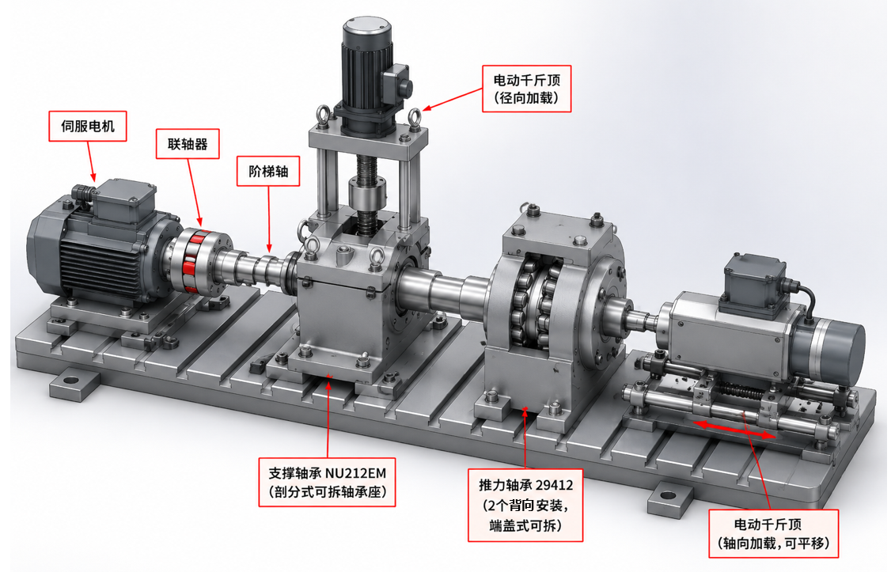

# 试验台合同

## 技术协议书

### 1. 总体要求

（1） 试验台用于模拟船舶吊舱推进器轴承在实际运行中的受力工况，采集推力轴承与支撑轴承在正常状态及人工预制故障状态下的振动信号，用于轴承故障诊断研究。

（2） 试验台为缩比试验台，应能独立施加轴向力与径向力，并可单独或同时加载，以模拟纯轴向、纯径向及轴向-径向复合工况。

（3） 试验台采用卧式布置，整机集成于工作台上，含传动系统、加载系统、测量系统、控制系统及防护装置，整体打包交付，到货后无需复杂二次调试即可使用。示意图如下图所示：

### 2. 被测轴承及配置要求

试验台被测轴承及配套轴承型号应按下表执行，不得擅自变更。所有轴承应为合格正品。

| 编号 | 名称 | 型号 | 说明 |
| --- | --- | --- | --- |
| 1 | 被测推力轴承 | 29412（球面滚子推力轴承） | 承受轴向力，内径60mm、外径130mm、高度42mm；一组2个推力轴承，背对背安置 |
| 2 | 被测支撑轴承 | NU 212EM（单列圆柱滚子轴承） | 承受径向力，内径60mm、外径110mm、高度22mm |

### 3. 传动系统与转速要求

（1） 驱动电机采用三相电机，须能实现无级调速，能够稳定控制电机的启动、停止与转速；

（2） 转速可调范围不低于 0～1400 r/min，常用工作转速 600～1000 r/min 范围内应能稳定连续运行，电机运行时应能显示当前转速；

（3） 电机额定功率应保证在最大轴向载荷（50kN）及最高转速工况下连续运行不过载、不失速；

（4） 电机与轴系连接应保证对中良好，自身振动不得干扰被测轴承振动信号的采集；传动方式采用膜片联轴器。

### 4. 轴向力加载系统

（1） 向被测推力轴承施加轴向力，加载范围 0～50 kN，连续可调；

（2） 采用千斤顶加载，配套压力（力）传感器实时监测并显示加载值，测量精度不低于 0.2% F.S；

（3） 轴向加载须通过辅助推力轴承作用于旋转轴，加载装置与旋转件之间不得直接接触；加载力须形成完整的力闭环回路；

（4） 在常用工况下加载力应能保持基本稳定，不可随装置运行有较大波动；若为手动千斤顶，应说明长时间运行（≥2小时）下的载荷保持及补压方式。

### 5. 径向力加载系统

（1） 向被测支撑轴承施加径向力，加载范围 0～20 kN，连续可调，以覆盖小载荷至大载荷工况；

（2） 采用千斤顶加载，配套压力（力）传感器实时监测并显示加载值，测量精度不低于 0.2% F.S；

（3） 径向加载须通过加载轴承作用于旋转轴，加载装置与旋转件之间不得直接接触；

（4） 在常用工况下加载力应能保持基本稳定，不可随装置运行有较大波动；若为手动千斤顶，应说明长时间运行（≥2小时）下的载荷保持及补压方式；

（5） 轴向与径向加载应可独立调节，支持单独加载与同时加载。

### 6. 故障轴承（人工预制故障）

乙方须提供人工预制故障的试验轴承，覆盖不同故障位置与故障类型，具体要求如下：

（1） 故障轴承应分别针对被测推力轴承（29412）和被测支撑轴承（NU 212）制作；

（2） 故障位置应覆盖：内圈、外圈、滚动体（滚子）三种典型位置；

（3） 故障类型应包括：点蚀、磨损等典型故障形式；

（4） 故障程度应设置梯度故障，分为轻度故障和重度故障两种梯度；

（5） 故障轴承数量：故障轴承数量如下所示：

推力轴承：内圈轻度磨损，重度磨损，轻度点蚀，重度点蚀；外圈轻度磨损，重度磨损，轻度点蚀，重度点蚀；滚动体轻度磨损，重度磨损，轻度点蚀，重度点蚀共12个故障轴承；

支撑轴承：内圈轻度磨损，重度磨损，轻度点蚀，重度点蚀；外圈轻度磨损，重度磨损，轻度点蚀，重度点蚀；滚动体轻度磨损，重度磨损，轻度点蚀，重度点蚀共12个故障轴承；

合计故障轴承数量：24个

（6）故障程度：

| 故障类型 | 量化指标 | 轻度故障 | 重度故障 |
| --- | --- | --- | --- |
| 点蚀 | 直径*深度 | 直径0.6mm左右，深度0.4mm左右 | 直径1.2mm左右，深度0.7mm左右 |
| 磨损 | 深度/粗糙度 | 深度0.07mm左右，表面粗糙度Ra1.6-3.2μm | 深度0.18mm左右，表面粗糙度6.3-12.5μm |

（7） 故障应采用可控加工方式（如线切割、电火花等）预制，故障的位置、尺寸（长/宽/深）须提供加工记录或图纸，保证可重复、可标定；

（8） 每个被测轴承应另配正常（无故障）轴承，以便采集正常状态基准信号，合计一组2个推力轴承，1个支撑轴承，共3个。

### 7. 控制系统与安全防护

（1） 配置控制箱，可控制三相电机的启动、停止与转速调节，设紧急停止按钮；

（2） 控制箱供电 380VAC，配置漏电保护器及必要的过载/短路保护，电源线不少于5米；

（3） 控制面板应实时显示轴向力、径向力数值，并显示转速等关键参数；

（4） 旋转部件及加载部件应配置防护罩，保证操作安全。

### 8. 工作台与机械结构

（1） 配套工作台（平台长度约1.2米，以实际为准），结构刚度应满足在最大加载（轴向50kN、径向20kN）下不产生影响测量的明显变形或附加振动；

（2） 机架及承力结构应按最大加载工况进行强度与刚度校核，承力路径清晰、可靠；

（3） 轴系应保证两被测轴承可靠定位与便捷拆装，便于更换正常/故障轴承；应考虑热膨胀补偿（如支撑端轴向可微动）；

（4） 整机配置移动脚轮及锁定装置（如适用），便于移动与固定。

### 9. 交付清单

（1） 试验台整机1套（含电机及变频调速系统、轴向加载系统、径向加载系统、轴系及轴承座、工作台、防护罩、控制箱）；

（2） 被测正常轴承及故障轴承（数量按第6条）；

（3） 随机技术资料：使用说明书、电气原理图、关键部件清单、轴承及故障加工记录、传感器标定/合格证明、装箱清单等。

### 10. 验收标准

（1） 乙方生产完成后需录制视频，甲方视频验收合格后安排发货；

（2） 到货后整机外观完好、配置与本技术要求及装箱清单一致；

（3） 通电试运行：电机可在 0～1400 r/min 范围内无级调速并稳定运行；启停、急停功能正常；

（4） 加载试验：轴向 0～50kN、径向 0～20kN 范围内加载正常，力值实时显示且精度满足 0.2% F.S。

（5） 测量验证：各测点振动信号采集正常；在正常轴承与故障轴承下能采集到可区分的振动信号；

（6） 上述项目全部合格，双方签署验收单后视为验收通过。

### 11. 质保与售后服务

（1） 整机质保期不低于1年，质保期内因产品质量问题免费维修或更换；提供终身维护服务；

（2） 乙方提供安装调试指导及操作培训，保证甲方能够独立操作试验台；

（3） 质保期内供方应在接到故障通知后及时响应并提供解决方案。

### 12. 其他约定

（1） 本技术要求未尽事宜，由甲乙双方协商确定并以书面形式（补充协议/确认单）固定；

（2） 乙方在生产前应向需方提交关键参数确认单（含电机功率与调速范围、传感器配置清单、故障轴承清单及加工方案），经甲方书面确认后方可投产。
